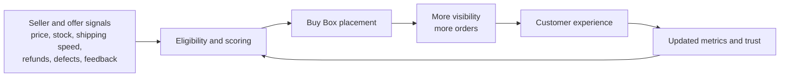
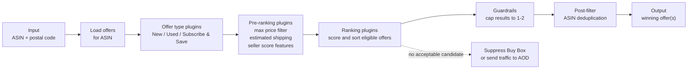

<Summary>
The Amazon Buy Box is an offer-ranking system disguised as a small UI panel. Its job is to choose the offer most likely to convert without degrading the customer experience, which means balancing price, fulfillment quality, inventory health, and seller reliability at marketplace scale.
</Summary>

Whenever you land on digital real estate owned by Amazon, the machine has one singular mission: sell.

That creates an interesting UX problem:

> How should an online marketplace decide which offer to surface first?

You can think of the Buy Box as Amazon's answer to that question. Whether you call it offer ranking, featured placement, or marketplace recommendation, the platform still has to make one hard decision: which offer deserves the top position?

A reasonable hypothesis is that Amazon wants to maximize conversion while minimizing friction. In practice, that means surfacing the offer that is most likely to turn a browsing customer into a buyer with as little hesitation as possible. For a catalog with hundreds of millions of products, though, the hard part is defining exactly what "most attractive" means at scale.

That is what makes the Amazon Buy Box so interesting. It is one of the most visible offer-recommendation engines on the internet.

## Why the Buy Box Matters

For a large share of Amazon's catalog, one of two things happens:

- A merchant wins the Buy Box.
- Amazon suppresses it because no offer clears the threshold.

Whoever wins that slot immediately gains distribution. The benefit is not subtle. The featured offer gets the prime call to action, the default "Add to Cart" path, and an implicit signal of trust. Customers often treat that placement as a quiet endorsement from Amazon itself, which further increases the probability of a sale.

In that sense, the Buy Box works like the inverse of a credit bureau. Credit bureaus combine signals to estimate default risk before extending capital. Amazon combines signals to estimate customer-experience risk before extending attention, traffic, and revenue. If Amazon grants that visibility to overpriced offers, unreliable merchants, or stock that cannot actually ship, the result is a bad customer experience. Enough bad experiences, and future customers become less willing to buy.

<DiagramTabs>
  <DiagramContent>
    <Mermaid chart={`
flowchart LR
    metrics["Seller and offer signals<br/>price, stock, shipping speed,<br/>refunds, defects, feedback"] --> score["Eligibility and scoring"]
    score --> buybox["Buy Box placement"]
    buybox --> sales["More visibility<br/>more orders"]
    sales --> cx["Customer experience"]
    cx --> feedback["Updated metrics and trust"]
    feedback --> score
`} />
  </DiagramContent>

  <MermaidContent>



  </MermaidContent>

  <AsciiContent>

```
┌─────────────────────────────────────────────────────────────────────┐
│ Seller and offer signals                                           │
│ price, stock, shipping speed, refunds, defects, feedback           │
└─────────────────────────────────────────────────────────────────────┘
                              │
                              ▼
┌─────────────────────────────────────────────────────────────────────┐
│ Eligibility and scoring                                            │
└─────────────────────────────────────────────────────────────────────┘
                              │
                              ▼
┌─────────────────────────────────────────────────────────────────────┐
│ Buy Box placement                                                  │
└─────────────────────────────────────────────────────────────────────┘
                              │
                              ▼
┌─────────────────────────────────────────────────────────────────────┐
│ More visibility and more orders                                    │
└─────────────────────────────────────────────────────────────────────┘
                              │
                              ▼
┌─────────────────────────────────────────────────────────────────────┐
│ Customer experience                                                │
└─────────────────────────────────────────────────────────────────────┘
                              │
                              ▼
┌─────────────────────────────────────────────────────────────────────┐
│ Updated metrics and trust                                          │
└─────────────────────────────────────────────────────────────────────┘
                              │
                              └────────────── back into scoring ─────┘
```

  </AsciiContent>
</DiagramTabs>

## Where Is It?

Everywhere.

If you have ever seen the white purchase module on the right side of an Amazon product page, you have seen the Buy Box. But its reach goes well beyond the product-detail page:

- The "Add to Cart" button on your TV during a Prime Video advertisement? Buy Box.
- The Amazon homepage? Buy Box.
- Search and navigation surfaces that need a default offer? Buy Box.

There is really only one notable exception: the All Offer Display (AOD).

Using a physical clothing store as an analogy, the Buy Box is the front display window. It showcases the offer Amazon most wants you to buy. The AOD is the back room: the place where the rest of the eligible inventory sits when it does not earn the premium shelf space.

## Business Requirements to Qualify

Qualifying for the Buy Box and winning the Buy Box are different problems. The first is about eligibility. The second is about ranking.

Before a seller can even compete, Amazon expects the basics to be in order:

- **Seller status:** You generally need to be a Professional Seller, which means paying the monthly subscription fee.
- **Product condition:** Only new items can win the primary Buy Box. Used inventory does not compete for that slot.
- **Inventory status:** If the offer goes out of stock, the placement disappears immediately.
- **Historical stock consistency:** Frequent stockouts damage trust over time and reduce future eligibility.
- **Price competitiveness:** The offer needs a competitive landed price once shipping, handling, and tax expectations are considered.
- **Fulfillment method:** Fulfillment by Amazon (FBA) is heavily favored because it reduces shipping and service variability.
- **Shipping speed:** Slow or unreliable delivery makes an offer less attractive even if the list price looks good.
- **Performance metrics and feedback:** Amazon monitors late shipments, refunds, order defect rate (ODR), and customer feedback across multiple time windows.

<Callout type="tip" title="Eligibility is not the same as winning">
Meeting the minimum business requirements only gets you into the candidate set. The ranking system still has to decide whether your offer is the best option for a specific customer, at a specific time, in a specific location.
</Callout>

## Under the Hood: A Simplified Buy Box System Design

To understand how to win, it helps to think like the engineering team building the system. The real implementation is almost certainly more complex than this, but the simplified model captures the essential logic.

<Callout type="info" title="Important simplification">
Amazon does not publish the full Buy Box implementation. Treat the design below as a mental model rather than a literal internal specification.
</Callout>

### Glossary

- **Product:** A distinct item for sale.
- **Offer:** A data structure that describes the terms under which a product can be purchased.
- **Offer type:** A class of offer such as New, Used, or Subscribe & Save.

### System Requirements

- Every product has a unique identifier called an ASIN (Amazon Standard Identification Number).
- Every product can have `N` offers, where `0 <= N <= ~200`.
- Every offer belongs to one of `K` offer types.
- Offer types are ranked, because some classes of offer are more eligible than others.

### Input and Output

- **Input:** ASIN, postal code
- **Output:** one to two winning offers

### The Solution: Everything Is a Plugin

One useful way to frame the system is as a sequence of modular plugins. Each stage has a narrow job, and each stage reduces uncertainty for the next one.

<DiagramTabs>
  <DiagramContent>
    <Mermaid chart={`
flowchart LR
    input["Input<br/>ASIN + postal code"] --> load["Load offers<br/>for ASIN"]
    load --> type["Offer type plugins<br/>New / Used / Subscribe & Save"]
    type --> pre["Pre-ranking plugins<br/>max price filter<br/>estimated shipping<br/>seller score features"]
    pre --> rank["Ranking plugins<br/>score and sort eligible offers"]
    rank --> guard["Guardrails<br/>cap results to 1-2"]
    guard --> post["Post-filter<br/>ASIN deduplication"]
    post --> output["Output<br/>winning offer(s)"]
    rank -. no acceptable candidate .-> aod["Suppress Buy Box<br/>or send traffic to AOD"]
`} />
  </DiagramContent>

  <MermaidContent>



  </MermaidContent>

  <AsciiContent>

```
┌─────────────────────────────┐
│ Input                       │
│ ASIN + postal code          │
└─────────────────────────────┘
              │
              ▼
┌─────────────────────────────┐
│ Load offers for ASIN        │
└─────────────────────────────┘
              │
              ▼
┌─────────────────────────────┐
│ Offer type plugins          │
│ New / Used / Subscribe      │
└─────────────────────────────┘
              │
              ▼
┌─────────────────────────────┐
│ Pre-ranking plugins         │
│ max price filter            │
│ estimated shipping          │
│ seller score features       │
└─────────────────────────────┘
              │
              ▼
┌─────────────────────────────┐
│ Ranking plugins             │
│ score and sort offers       │
└─────────────────────────────┘
              │
      ┌───────┴────────┐
      ▼                ▼
┌───────────────┐   ┌─────────────────────────────┐
│ Guardrails    │   │ Suppress Buy Box or route   │
│ cap to 1-2    │   │ the shopper to the AOD      │
└───────────────┘   └─────────────────────────────┘
      │
      ▼
┌─────────────────────────────┐
│ Post-filter                 │
│ ASIN deduplication          │
└─────────────────────────────┘
      │
      ▼
┌─────────────────────────────┐
│ Output                      │
│ winning offer(s)            │
└─────────────────────────────┘
```

  </AsciiContent>
</DiagramTabs>

The pipeline breaks down cleanly:

1. **Offer type plugins** separate offers into buckets like New, Used, and Subscribe & Save.
2. **Pre-ranking plugins** filter obviously bad candidates and enrich the remaining offers with features such as estimated shipping and seller-quality signals.
3. **Ranking plugins** assign scores and sort the eligible offers.
4. **Guardrails** cap the number of winners, typically to one featured offer and, in some contexts, a secondary option.
5. **Post-filtering** cleans up the output, for example by deduplicating offers tied to the same ASIN.

This plugin framing is useful because it mirrors how large systems usually evolve. You do not want one giant function making every Buy Box decision. You want small, replaceable modules that can be tuned independently: pricing logic, shipping estimation, seller scoring, and offer-type handling.

## What "Attractive" Probably Means in Practice

At a high level, the winning offer is the one that best balances four goals:

- **Low total cost:** Not just list price, but the effective price after shipping and other purchase friction.
- **Fast fulfillment:** A cheap offer that arrives too late is often not the best offer.
- **High reliability:** Sellers with fewer defects, cancellations, and complaints are safer to feature.
- **In-stock confidence:** An offer that cannot stay available is a poor default, even if it looks great for a moment.

That is why the Buy Box is more than a simple "lowest price wins" rule. Amazon is selecting for conversion quality, not just sticker price.

## Conclusion

The Amazon Buy Box is some of the most valuable real estate in e-commerce, and winning it is fiercely competitive. It sits at the intersection of UX, marketplace economics, trust, fulfillment, and ranking systems.

If you sell on Amazon, earning and keeping the Buy Box should be a primary objective. If a competitor takes it from you, that does not necessarily mean your product is bad. It usually means your offer stopped looking like the safest, fastest, or most compelling default. The path back is straightforward in theory, even if it is hard in practice: cleaner metrics, more consistent inventory, stronger fulfillment, and a more competitive offer.

## Appendix

### Buy Box Metrics to Watch

If you fulfill orders yourself through Seller-Fulfilled Prime (SFP), you need to watch the operating metrics especially closely. FBA sellers inherit much of the shipping and customer-service machinery from Amazon, but self-fulfilled sellers have to prove they can meet the same standard.

Representative targets to monitor:

| Metric | Target |
| --- | --- |
| Order Defect Rate | `< 1%` |
| Return Dissatisfaction Rate | `< 10%` |
| Buyer-Seller Contact Rate | `< 25%` |
| Response Times Under 24 Hours | `> 90%` |
| Late Responses | `< 10%` |
| Pre-Fulfillment Cancel Rate | `< 2.5%` |
| Late Shipment Rate | `< 4%` |
| Valid Tracking Rate (by category) | `> 90%` |
| Delivered on Time | `> 97%` |
