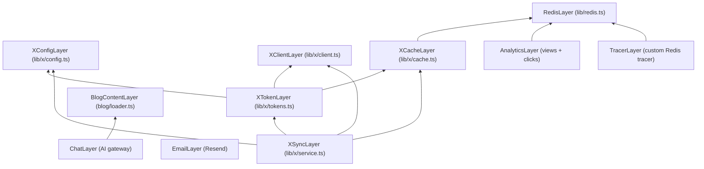

# Effect.ts Adoption Report

**Date**: 2026-03-12
**Repository**: claycurry.studio (Turborepo monorepo, Next.js 16, React 19)
**Research**: 16 documents across 3 phases, 5 feasibility spikes (all GO)

---

## 1. Executive Summary

**Recommendation: Adopt Effect.ts incrementally, starting with the Redis layer.**

The codebase has a well-architected module graph with no circular dependencies and
a clean client/server separation. However, it suffers from 11 unhandled async
error paths, 7 silently swallowed errors, zero test coverage on all 9 API routes,
and a Redis connection singleton that never recovers from failure. Effect.ts
addresses all of these through typed error channels, dependency injection via
Layers, and built-in tracing — without requiring a big-bang rewrite.

All 5 feasibility spikes returned GO verdicts. The migration is incremental: each
step produces independently testable, deployable code. The primary risk is team
learning curve for Effect's functional patterns; the primary mitigation is
starting with the simplest module (`lib/redis.ts`) and expanding outward.

---

## 2. Current State Assessment

### 2.1 Architecture

```
apps/www/
├── app/api/          9 route handlers (chat, contact, feedback, views, clicks, x/*)
├── lib/
│   ├── redis.ts      Shared infrastructure (6 consumers)
│   ├── x/            X/Twitter integration (9 modules, strict layering)
│   ├── hooks/        Client-side React hooks (5 modules)
│   ├── chat/         Chat model definitions
│   ├── db/           Dexie IndexedDB (client-side)
│   └── components/   UI components (shadcn/ui, chat, content, site)
└── blog/*.mdx        MDX blog posts with frontmatter
```

**Strengths**: Clean DAG (no circular deps), well-encapsulated X cluster with
single shared dependency (`lib/redis`), explicit imports (no barrel exports),
clean client/server split.

**Weaknesses**: 7 module-level singletons with no lifecycle management, blog
loader lives outside `lib/`, no middleware file, no observability beyond
`console.log`.

### 2.2 Side Effect Inventory

| Category | Count | Key Examples |
|----------|-------|-------------|
| External API calls | 5 services | Redis, X API, GitHub API, Resend, AI gateway |
| Module singletons | 7 | `redisClient`, `githubCache`, `cachedPosts`, 3 in-memory Maps, oEmbed cache |
| Route handlers | 9 | All effectful, none with comprehensive error handling |
| Filesystem I/O | 1 | Blog loader (`fs.readFileSync`) |

### 2.3 Error Handling Analysis

| Issue | Count | Severity |
|-------|-------|----------|
| Silent swallows | 7 | High — errors vanish without logging |
| Untyped catches | 8 | Medium — `catch (error)` with no narrowing |
| Missing error handlers | 11 | Critical — async ops without try-catch → unstructured 500s |
| XSS risk | 1 | High — unsanitized HTML in contact email body |
| Broken singleton | 1 | Critical — Redis connection failure never recovered |

**Bright spot**: The X integration cluster has a well-designed `XIntegrationError`
model with typed codes, `toIntegrationError()` normalizer, and stale-cache
fallback. This pattern is worth preserving and extending.

### 2.4 Test Coverage

| Metric | Value |
|--------|-------|
| Test files | 4 (all in `lib/x/`) |
| Test cases | 13 |
| API routes tested | 0 / 9 |
| Modules needing tests | 19 |
| Estimated new tests | ~106 |
| Test framework | `node:test` (no Vitest/Jest) |
| Test script in `apps/www` | **Missing** — `turbo test` silently skips |

**Immediate blocker**: No `"test"` script in `apps/www/package.json`.

Full analysis: [`docs/research/01-test-gaps.md`](./research/01-test-gaps.md)

---

## 3. Effect.ts Integration Recommendation

### 3.1 Verdict: GO — All 5 Spikes Passed

| Spike | Verdict | Key Finding |
|-------|---------|-------------|
| Route handlers | GO | `Effect.runPromise()` works in App Router; hybrid pattern for streaming |
| Serverless layers | GO | `ManagedRuntime` at module scope; `GlobalValue` prevents HMR duplication |
| Schema migration | GO (conditional) | Zod/@effect/schema coexist; migrate only when touching a module |
| Custom tracer | GO | Effect `Tracer` interface is simple; Redis span persistence via `end()` hook |
| Error model | GO | `XIntegrationError` maps 1:1 to `Data.TaggedError`; incremental migration |

Full analysis: [`docs/research/02-feasibility-summary.md`](./research/02-feasibility-summary.md)

### 3.2 Migration Priority Order

**Start with RedisLayer** (highest impact, simplest boundary):

| Priority | Module | Why First | Effort |
|----------|--------|-----------|--------|
| 1 | `lib/redis.ts` → `RedisLayer` | 6 consumers, fixes connection bug, enables test DI | 1 day |
| 2 | `lib/x/errors.ts` → Tagged errors | Foundation for typed error channels | 0.5 day |
| 3 | `lib/x/client.ts` → Effect programs | Leaf I/O module, wraps fetch calls | 1 day |
| 4 | `lib/x/tokens.ts` → Effect programs | Token refresh with typed errors | 1 day |
| 5 | `lib/x/service.ts` → Effect pipeline | Decomposes 200-line try-catch | 2 days |
| 6 | Route handlers → `AppRuntime.runPromise` | views/clicks first, bookmarks second | 2 days |
| 7 | Custom `Tracer` → Redis spans | Depends on route handler migration | 1 day |
| 8 | Schema migration (Zod → @effect/schema) | Only when touching the module | Ongoing |

### 3.3 Modules to Leave As-Is

| Module | Reason |
|--------|--------|
| `lib/x/contracts.ts` | 30 Zod schemas working correctly; migrate only with Schema |
| `lib/x/atoms.ts` | Client-side Jotai; Effect is server-only |
| `lib/hooks/*` | React hooks; Effect doesn't apply |
| `lib/db/index.ts` | Client-side Dexie; Effect doesn't apply |
| `lib/portfolio-data.ts` | Pure data, no side effects |
| `lib/navigation.ts` | Pure data, no side effects |

### 3.4 Schema Migration Strategy

**Phase 0** (now): Keep all Zod schemas. Add `Effect.try(() => schema.parse(x))`
adapters where Effect programs call Zod validation.

**Phase 1** (when adding new domains): Write new schemas in `@effect/schema`.
Zod and Schema coexist — they produce structurally identical TypeScript types.

**Phase 2** (opportunistic): When modifying an existing module, convert its
schemas from Zod to `@effect/schema`. The 3 call-site patterns (`parseContract`,
`getValidated`/`setValidated`, direct `.parse()`) each have a 1-line adapter.

**No urgency.** Zod works fine. Schema gives bidirectional encode/decode and
native error channel integration, but these only matter once Effect is adopted.

---

## 4. Error Model Redesign

### 4.1 Current Model

```typescript
// lib/x/errors.ts
class XIntegrationError extends Error {
  constructor(
    public readonly code: IntegrationIssueCode,
    message: string,
    public readonly extra?: Record<string, unknown>
  ) { super(message) }
}

// Usage: throw/catch with manual code switching
try { ... } catch (e) {
  const err = toIntegrationError(e)
  switch (err.code) { ... }
}
```

### 4.2 Target Model

```typescript
// lib/x/errors.ts (Effect version)
class ReauthRequired extends Data.TaggedError("ReauthRequired")<{
  message: string; tokenStatus?: string; cause?: unknown
}> {}

class OwnerMismatch extends Data.TaggedError("OwnerMismatch")<{
  message: string; cause?: unknown
}> {}

class SchemaInvalid extends Data.TaggedError("SchemaInvalid")<{
  message: string; cause?: unknown
}> {}

class UpstreamError extends Data.TaggedError("UpstreamError")<{
  message: string; cause?: unknown
}> {}

type XIntegrationErrors =
  | ReauthRequired | OwnerMismatch | SchemaInvalid | UpstreamError

// Usage: type-safe catch with exhaustive handling
const program = Effect.gen(function* () {
  const token = yield* getTokenForSync(...)    // Error: ReauthRequired | OwnerMismatch
  const owner = yield* verifyIdentity(token)   // Error: OwnerMismatch
  const data  = yield* fetchBookmarks(owner)   // Error: UpstreamError | SchemaInvalid
  yield* saveSnapshot(data)
}).pipe(
  Effect.catchTags({
    ReauthRequired: (e) => serveStaleFallback(e),
    OwnerMismatch:  (e) => returnConflict(e),
    SchemaInvalid:  (e) => returnBadGateway(e),
    UpstreamError:  (e) => serveStaleFallback(e),
  })
)
```

### 4.3 Migration Path

1. **Define tagged errors** alongside existing `XIntegrationError` (coexist)
2. **Add bridge**: `fromXIntegrationError()` converts old → new at module boundaries
3. **Migrate leaf modules** (client.ts, tokens.ts) to throw tagged errors
4. **Migrate service.ts** — decompose the 200-line try-catch into Effect pipeline
5. **Delete** `toIntegrationError()` and `XIntegrationError` class when no callers remain

---

## 5. Testing Strategy

### 5.1 Framework Recommendation: Vitest

| Factor | `node:test` (current) | Vitest (recommended) |
|--------|----------------------|---------------------|
| TypeScript | `--experimental-strip-types` | Native support |
| Mocking | Manual stubs | `vi.mock`, `vi.fn`, `vi.spyOn` |
| Watch mode | None | Built-in |
| Coverage | External tool | Built-in |
| Ecosystem | Minimal | Rich plugin ecosystem |
| Migration | 13 tests to port | `node:assert` compatible |

### 5.2 Test Architecture with Effect Layers

```typescript
// Test with real Redis → RedisLive layer
// Test with in-memory → RedisTest layer
// Same test code, different layer provision

const testBookmarkSync = Effect.gen(function* () {
  const service = yield* BookmarksSyncService
  const result = yield* service.getBookmarks()
  expect(result.httpStatus).toBe(200)
})

// Unit test: all mocks
await Effect.runPromise(
  testBookmarkSync.pipe(Effect.provide(TestLayers))
)

// Integration test: real Redis
await Effect.runPromise(
  testBookmarkSync.pipe(Effect.provide(IntegrationLayers))
)
```

### 5.3 Priority Order for New Tests

| Tier | Modules | Tests | Effort |
|------|---------|-------|--------|
| Critical | `redis.ts`, `tokens.ts`, views, clicks, chat | ~49 | ~12h |
| High | `cache.ts`, blog loader, contact, feedback, x/auth, x/callback, x/bookmarks | ~45 | ~12h |
| Medium | `errors.ts`, `oembed.ts`, bookmarks/status | ~16 | ~3h |
| Low | `runtime.ts`, `navigation.ts`, `portfolio-data.ts` | ~4 | ~1h |

**Immediate action**: Add `"test"` script to `apps/www/package.json` so
`turbo test` stops silently skipping the workspace.

Full analysis: [`docs/research/01-test-gaps.md`](./research/01-test-gaps.md)

---

## 6. Tracing System Design

### 6.1 Architecture

```
Browser → Cookie (__trace) → Middleware → Header (x-trace-id) → Route Handler → Service
                                                                      ↓
                                                              persistSpan()
                                                                      ↓
                                                              Redis: trace:{id}:spans
                                                                      ↓
                                                              GET /api/trace/[id]
```

### 6.2 Cookie Protocol

| Property | Value |
|----------|-------|
| Name | `__trace` |
| Value | 32-char hex (UUID v4 sans dashes) |
| Path | `/api` |
| SameSite | `Strict` |
| HttpOnly | `true` |
| Secure | `true` (production) |
| Max-Age | `3600` (1 hour) |

### 6.3 Span Data Model

```typescript
interface SpanRecord {
  traceId: string          // 32-char hex from cookie
  spanId: string           // 16-char hex, unique per span
  parentSpanId: string | null
  name: string             // e.g. "BookmarksSyncService.getBookmarks"
  startTime: string        // ISO 8601
  endTime: string          // ISO 8601
  durationMs: number
  status: "ok" | "error"
  attributes: Record<string, string | number | boolean>
  events: Array<{ name: string; time: string; attributes?: Record<string, unknown> }>
}
```

### 6.4 Storage

- **Write**: `RPUSH trace:{traceId}:spans {JSON}` with fire-and-forget
- **TTL**: 1 hour on first write via `EXPIRE`
- **Read**: `GET /api/trace/[id]` → JSON array, access-controlled by cookie match or `X_OWNER_SECRET`
- **Budget**: ~500 KB steady-state at current traffic (~100 req/hr)

### 6.5 Implementation Approach

**Start with AsyncLocalStorage** (zero new dependencies), then migrate to
Effect's native `Tracer` when route handlers are converted. The storage layer
(`persistSpan`, Redis schema, retrieval API) is tracer-agnostic.

Full analysis: [`docs/research/03-tracing-design.md`](./research/03-tracing-design.md)

---

## 7. Preproduction Mock System

**Already implemented** on this branch:

- `lib/x/mock-bookmarks.ts` — 8 realistic bookmark fixtures, 3 folders
- `lib/x/runtime.ts` — `BookmarksSyncServiceLike` interface + `createMockSyncService()`

**Behavior**: When `VERCEL_ENV !== "production"` AND `X_CLIENT_ID`/`X_CLIENT_SECRET`
are not set, `createBookmarksSyncService()` returns mock data instead of hitting
the live X API. Production behavior is unchanged.

---

## 8. Migration Roadmap

### Phase 0: Foundation (1 week)

- [ ] Add `"test"` script to `apps/www/package.json`
- [ ] Extract shared test utilities from inline stubs (`MemoryRepository`, `withEnv()`, factories)
- [ ] Install Vitest, migrate 13 existing `node:test` tests
- [ ] Write tests for `lib/redis.ts` (8 tests, easy, pure functions + singleton)
- [ ] Fix XSS in contact route (`message` HTML injection in email body)
- [ ] Fix 7 silent swallows (add logging to empty catch blocks)

### Phase 1: Effect Core (2 weeks)

- [ ] Install `effect` package
- [ ] Create `RedisLayer` wrapping `lib/redis.ts` with `acquireRelease`
- [ ] Create `RedisTest` layer (in-memory Map)
- [ ] Define tagged errors (`ReauthRequired`, `OwnerMismatch`, `SchemaInvalid`, `UpstreamError`)
- [ ] Bridge function: `fromXIntegrationError()`
- [ ] Migrate `lib/x/client.ts` to return Effect programs
- [ ] Migrate `lib/x/tokens.ts` to return Effect programs
- [ ] Write tests for each using `RedisTest` layer
- [ ] Create `ManagedRuntime` at module scope with `GlobalValue`

### Phase 2: Service Orchestrator (1 week)

- [ ] Decompose `BookmarksSyncService.getBookmarks()` into Effect pipeline
- [ ] Replace 200-line try-catch with `Effect.catchTags()`
- [ ] Migrate route handlers to `AppRuntime.runPromise()`
  - views/clicks (simplest, 2 routes)
  - bookmarks/status (3 routes)
  - chat (hybrid pattern for streaming)
  - contact/feedback (2 routes)
- [ ] Write route handler tests with mock layers

### Phase 3: Tracing (1 week)

- [ ] Create `apps/www/middleware.ts` for `__trace` cookie
- [ ] Implement `lib/tracing/tracer.ts` with AsyncLocalStorage
- [ ] Implement `lib/tracing/storage.ts` with Redis RPUSH
- [ ] Create `GET /api/trace/[id]` retrieval endpoint
- [ ] Instrument bookmark sync flow (highest-value target)
- [ ] Instrument remaining routes

### Phase 4: Schema Migration (ongoing, no deadline)

- [ ] Write new domain schemas in `@effect/schema`
- [ ] Convert existing schemas when modifying their module
- [ ] Remove Zod dependency when all schemas are migrated

### Rollback Plan

Each phase is independently deployable. If Effect causes issues:
- **Phase 1**: Revert to raw `lib/redis.ts`; tagged errors can coexist with old model
- **Phase 2**: Service can be reverted to try-catch; route handlers to raw async
- **Phase 3**: Tracing is additive — removing it has zero impact on business logic
- **Phase 4**: Zod and Schema coexist; no forced migration

---

## 9. Appendices

### A. Research Documents

| Phase | Document | Path |
|-------|----------|------|
| 1 | Baseline summary | [`01-baseline-inventory.md`](./research/01-baseline-inventory.md) |
| 1 | Side effect inventory | [`01-side-effect-inventory.md`](./research/01-side-effect-inventory.md) |
| 1 | Error flow analysis | [`01-error-flows.md`](./research/01-error-flows.md) |
| 1 | Test coverage gaps | [`01-test-gaps.md`](./research/01-test-gaps.md) |
| 1 | Dependency graph | [`01-dependency-graph.md`](./research/01-dependency-graph.md) |
| 2 | Feasibility summary | [`02-feasibility-summary.md`](./research/02-feasibility-summary.md) |
| 2 | Route handlers spike | [`02-spike-route-handlers.md`](./research/02-spike-route-handlers.md) |
| 2 | Serverless layers spike | [`02-spike-serverless-layers.md`](./research/02-spike-serverless-layers.md) |
| 2 | Schema migration spike | [`02-spike-schema-migration.md`](./research/02-spike-schema-migration.md) |
| 2 | Custom tracer spike | [`02-spike-tracer.md`](./research/02-spike-tracer.md) |
| 2 | Error model spike | [`02-spike-error-model.md`](./research/02-spike-error-model.md) |
| 3 | Tracing design summary | [`03-tracing-design.md`](./research/03-tracing-design.md) |
| 3 | Trace data model | [`03-trace-data-model.md`](./research/03-trace-data-model.md) |
| 3 | Cookie protocol | [`03-cookie-protocol.md`](./research/03-cookie-protocol.md) |
| 3 | Trace API | [`03-trace-api.md`](./research/03-trace-api.md) |
| 3 | Tracer comparison | [`03-tracer-comparison.md`](./research/03-tracer-comparison.md) |

### B. Effect.ts Layer Map



### C. Decision Log

| Decision | Chosen | Rejected | Rationale |
|----------|--------|----------|-----------|
| Effect adoption | Incremental | Big-bang rewrite | Each step is independently deployable |
| First Layer | RedisLayer | XSyncLayer | Highest consumer count (6), fixes real bug |
| Tracing start | AsyncLocalStorage | Effect Tracer | Zero new deps; migrate to Effect when ready |
| Schema migration | Coexist → gradual | Immediate rewrite | 30 Zod schemas work fine; no urgency |
| Test framework | Vitest | Stay with `node:test` | Native TS, mocking, watch mode, coverage |
| Trace storage | Redis lists | SQLite / OpenTelemetry | Reuses existing infra, auto-TTL cleanup |
| Cookie scope | `/api` only | All paths | Traces only matter for API routes |
| Mock bookmarks | Static file in `lib/x/` | Env-gated fixture server | Simplest approach; no new infrastructure |
