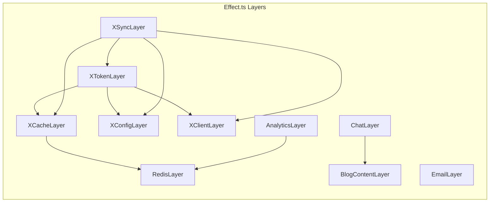

# Module Boundaries & Dependency Graph

> Generated 2026-03-12 by cataloging every non-UI `.ts` source file under
> `apps/www/lib/`, every `app/api/**/route.ts`, and `next.config.mjs`.

---

## 1. Module Catalog

### Legend

| Column | Meaning |
|--------|---------|
| **Internal** | Imports from other project modules (`@/...`) |
| **External** | npm / Node.js built-in imports |
| **Exports** | Public surface (functions, classes, types, constants) |
| **Side Effects** | **Pure** = no I/O; **Effectful** = performs I/O (network, disk, DB); **Mixed** = both pure helpers and I/O |

---

### 1.1 `lib/` modules

#### `lib/utils.ts`
| | |
|---|---|
| Internal | *(none)* |
| External | `clsx`, `tailwind-merge`, `react` (type only) |
| Exports | `cn()`, `slugify()` |
| Side Effects | **Pure** |

#### `lib/site-url.ts`
| | |
|---|---|
| Internal | *(none)* |
| External | *(none)* |
| Exports | `SITE_ORIGIN` (const), `toSiteUrl()` |
| Side Effects | **Pure** |

#### `lib/portfolio-data.ts`
| | |
|---|---|
| Internal | *(none)* |
| External | *(none)* |
| Exports | `locationData`, `profileData`, `siteConfig`, `aboutData`, `resumeData`, `blogData`, `contactData` |
| Side Effects | **Pure** |

#### `lib/navigation.ts`
| | |
|---|---|
| Internal | *(none)* |
| External | *(none)* |
| Exports | `NavLink` (type), `getSiteNavLinks()` |
| Side Effects | **Pure** |

#### `lib/favicon.ts`
| | |
|---|---|
| Internal | *(none)* |
| External | *(none)* |
| Exports | `getFaviconSvg()`, `updateFavicon()` |
| Side Effects | **Effectful** (DOM mutation in `updateFavicon`) |

#### `lib/redis.ts`
| | |
|---|---|
| Internal | *(none)* |
| External | `redis` (`createClient`) |
| Exports | `getRedisClient()`, `getInMemoryStore()`, `keyPrefix()` |
| Side Effects | **Effectful** (Redis connection, env reads) |

#### `lib/og/load-font.ts`
| | |
|---|---|
| Internal | *(none)* |
| External | *(none -- uses global `fetch`)* |
| Exports | `loadGoogleFont()` |
| Side Effects | **Effectful** (network fetch) |

#### `lib/chat/models.ts`
| | |
|---|---|
| Internal | *(none)* |
| External | *(none)* |
| Exports | `CHAT_MODELS` (const), `ChatModel` (type), `DEFAULT_CHAT_MODEL` |
| Side Effects | **Pure** |

#### `lib/db/index.ts`
| | |
|---|---|
| Internal | *(none)* |
| External | `@ai-sdk/react` (type), `dexie` |
| Exports | `ChatContext` (type), `StoredMessage` (interface), `db` (Dexie instance) |
| Side Effects | **Effectful** (IndexedDB database instantiation at module load) |

#### `lib/resume/resume-page-data.ts`
| | |
|---|---|
| Internal | `@/lib/portfolio-data` |
| External | *(none)* |
| Exports | Many types + `resumeHeaderData`, `resumeSummaryPoints`, `resumeExperienceItems`, `resumeEducationItems`, `resumeAchievementItems` |
| Side Effects | **Pure** |

#### `lib/resume/index.ts` (barrel)
| | |
|---|---|
| Internal | `./components` (tsx, out of scope), `./contribution-section` (tsx) |
| External | *(none)* |
| Exports | Re-exports UI components (barrel only) |
| Side Effects | **Pure** |

---

### 1.2 `lib/hooks/` (all client-side)

#### `lib/hooks/use-mobile.ts`
| | |
|---|---|
| Internal | *(none)* |
| External | `react` |
| Exports | `useIsMobile()` |
| Side Effects | **Effectful** (window/matchMedia) |

#### `lib/hooks/use-chat-ui.ts`
| | |
|---|---|
| Internal | `@/lib/chat/models` |
| External | `jotai`, `jotai/utils` |
| Exports | Atoms: `chatPromptAtom`, `chatDrawerOpenAtom`, `chatDialogOpenAtom`, `chatModelAtom`; Hook: `useChatUI()` |
| Side Effects | **Effectful** (localStorage via `atomWithStorage`) |

#### `lib/hooks/use-chat-session.ts`
| | |
|---|---|
| Internal | `@/lib/chat/models`, `@/lib/db` |
| External | `@ai-sdk/react`, `@radix-ui/react-use-controllable-state`, `ai`, `dexie-react-hooks`, `react`, `sonner` |
| Exports | `ChatSessionConfig` (type), `useChatSession()`, re-exports `ChatModel`, `CHAT_MODELS` |
| Side Effects | **Effectful** (IndexedDB, network, toasts) |

#### `lib/hooks/use-click-counts.ts`
| | |
|---|---|
| Internal | *(none)* |
| External | `jotai`, `jotai/utils`, `react` |
| Exports | `clickCountsAtom`, `clickCountsEnabledAtom`, `useClickCountEngine()` |
| Side Effects | **Effectful** (network fetch, DOM listeners, `sendBeacon`) |

#### `lib/hooks/use-bookmarks.ts`
| | |
|---|---|
| Internal | `@/lib/x/atoms`, `@/lib/x/contracts` |
| External | `jotai`, `react` |
| Exports | `useBookmarks()` |
| Side Effects | **Effectful** (network fetch) |

---

### 1.3 `lib/x/` -- X (Twitter) Integration Cluster

#### `lib/x/config.ts`
| | |
|---|---|
| Internal | *(none)* |
| External | `zod` |
| Exports | `BOOKMARKS_SNAPSHOT_FRESHNESS_MS`, `TOKEN_REFRESH_WINDOW_MS`, `XRuntimeConfig` (interface), `XLiveRuntimeConfig` (interface), `getXRuntimeConfig()`, `assertLiveRuntimeConfig()`, `getXOwnerSecret()` |
| Side Effects | **Effectful** (reads `process.env`) |

#### `lib/x/contracts.ts`
| | |
|---|---|
| Internal | *(none)* |
| External | `zod` |
| Exports | ~30 Zod schemas and their inferred types (e.g. `NormalizedBookmarkSchema`, `BookmarksApiResponseSchema`, `XTokenRecordSchema`, etc.) |
| Side Effects | **Pure** |

#### `lib/x/errors.ts`
| | |
|---|---|
| Internal | `./contracts` (type only) |
| External | *(none)* |
| Exports | `XIntegrationError` (class), `toIntegrationError()`, `toIntegrationIssue()` |
| Side Effects | **Pure** |

#### `lib/x/client.ts`
| | |
|---|---|
| Internal | `./contracts`, `./errors` |
| External | *(none -- uses injected `fetch`)* |
| Exports | `XBookmarksClient` (class), `XBookmarksOwnerResolver` (class), `XIdentityVerifier` (class), re-exports types `BookmarkSourceOwner`, `NormalizedBookmark`, `XBookmarkFolder` |
| Side Effects | **Effectful** (network via X API) |

#### `lib/x/tokens.ts`
| | |
|---|---|
| Internal | `./cache` (type), `./config`, `./contracts`, `./errors` |
| External | *(none)* |
| Exports | `oauthStateStore` (Map), `XTokenStore` (class) |
| Side Effects | **Effectful** (network token exchange/refresh, repository writes) |

#### `lib/x/cache.ts`
| | |
|---|---|
| Internal | `@/lib/redis`, `./contracts` |
| External | `zod` (type only) |
| Exports | `BookmarksRepository` (interface), `BookmarksSnapshotRepository` (class) |
| Side Effects | **Effectful** (Redis/in-memory I/O) |

#### `lib/x/service.ts`
| | |
|---|---|
| Internal | `./cache` (type), `./client`, `./config`, `./contracts`, `./errors`, `./tokens` |
| External | *(none)* |
| Exports | `BookmarksSyncService` (class) |
| Side Effects | **Effectful** (orchestrates network + cache) |

#### `lib/x/runtime.ts`
| | |
|---|---|
| Internal | `./cache`, `./client`, `./config`, `./service` |
| External | *(none)* |
| Exports | `createBookmarksSyncService()` |
| Side Effects | **Effectful** (factory -- reads env, constructs live clients) |

#### `lib/x/atoms.ts`
| | |
|---|---|
| Internal | `./client` (type only) |
| External | `jotai`, `jotai/utils` |
| Exports | Sort/filter/folder atoms, `bookmarksDataAtom`, `bookmarksFoldersAtom`, `sortedBookmarksAtom` (derived) |
| Side Effects | **Effectful** (localStorage via `atomWithStorage`) |

#### `lib/x/oembed.ts`
| | |
|---|---|
| Internal | `@/lib/redis` |
| External | *(none)* |
| Exports | `OEmbedResponse` (interface), `fetchOEmbed()`, `fetchOEmbedBatch()` |
| Side Effects | **Effectful** (network + Redis cache) |

---

### 1.4 `app/api/` Route Handlers

#### `app/api/chat/route.ts`
| | |
|---|---|
| Internal | `@/app/(portfolio)/blog/loader`, `@/lib/portfolio-data` |
| External | `@ai-sdk/gateway` (type), `ai` |
| Exports | `maxDuration` (const), `POST()` |
| Side Effects | **Effectful** (LLM streaming, GitHub API fetch, file reads) |

#### `app/api/contact/route.ts`
| | |
|---|---|
| Internal | `@/lib/portfolio-data` |
| External | `next/server`, `resend` |
| Exports | `POST()` |
| Side Effects | **Effectful** (email send) |

#### `app/api/feedback/route.ts`
| | |
|---|---|
| Internal | `@/lib/portfolio-data` |
| External | `next/server`, `resend` |
| Exports | `POST()` |
| Side Effects | **Effectful** (email send) |

#### `app/api/clicks/route.ts`
| | |
|---|---|
| Internal | `@/lib/redis` |
| External | `next/server` |
| Exports | `GET()`, `POST()` |
| Side Effects | **Effectful** (Redis/in-memory counter) |

#### `app/api/views/route.ts`
| | |
|---|---|
| Internal | `@/lib/redis` |
| External | `next/server` |
| Exports | `GET()`, `POST()` |
| Side Effects | **Effectful** (Redis/in-memory counter, cookies) |

#### `app/api/x/auth/route.ts`
| | |
|---|---|
| Internal | `@/lib/redis`, `@/lib/x/config`, `@/lib/x/tokens` |
| External | `node:crypto`, `next/server` |
| Exports | `GET()` |
| Side Effects | **Effectful** (PKCE generation, Redis state storage, redirect) |

#### `app/api/x/bookmarks/route.ts`
| | |
|---|---|
| Internal | `@/lib/x/config`, `@/lib/x/contracts`, `@/lib/x/runtime` |
| External | `next/server` |
| Exports | `GET()` |
| Side Effects | **Effectful** (bookmark sync orchestration) |

#### `app/api/x/bookmarks/status/route.ts`
| | |
|---|---|
| Internal | `@/lib/x/config`, `@/lib/x/runtime` |
| External | `next/server` |
| Exports | `GET()` |
| Side Effects | **Effectful** (status query) |

#### `app/api/x/callback/route.ts`
| | |
|---|---|
| Internal | `@/lib/redis`, `@/lib/x/cache`, `@/lib/x/client`, `@/lib/x/config`, `@/lib/x/contracts`, `@/lib/x/errors`, `@/lib/x/tokens` |
| External | `next/server` |
| Exports | `GET()` |
| Side Effects | **Effectful** (OAuth token exchange, identity verification, status persistence) |

---

### 1.5 Other Top-Level Files

#### `app/(portfolio)/blog/loader.ts`
| | |
|---|---|
| Internal | *(none -- uses dynamic `import()` for MDX)* |
| External | `node:fs`, `node:path`, `gray-matter` |
| Exports | `PostMetadata` (type), `getPostMetadata()`, `getAllPostsMetadata()`, `getPost()`, `getPostContent()` |
| Side Effects | **Effectful** (filesystem reads, module-level cache) |

#### `next.config.mjs`
| | |
|---|---|
| Internal | *(none)* |
| External | `@next/mdx`, `rehype-katex`, `rehype-mdx-toc`, `rehype-pretty-code`, `remark-frontmatter`, `remark-gfm`, `remark-math`, `remark-mdx-frontmatter`, `node:module` |
| Exports | `mdxOptions`, default Next.js config |
| Side Effects | **Effectful** (config side effects on build toolchain) |

---

## 2. Dependency Graph

### 2.1 Mermaid Diagram

```mermaid
graph TD
    subgraph "Leaf Modules (no internal deps)"
        utils["lib/utils"]
        siteUrl["lib/site-url"]
        portfolioData["lib/portfolio-data"]
        navigation["lib/navigation"]
        favicon["lib/favicon"]
        redis["lib/redis"]
        ogFont["lib/og/load-font"]
        chatModels["lib/chat/models"]
        dbIndex["lib/db/index"]
        useMobile["lib/hooks/use-mobile"]
        useClickCounts["lib/hooks/use-click-counts"]
        xConfig["lib/x/config"]
        xContracts["lib/x/contracts"]
    end

    subgraph "X Integration Cluster"
        xErrors["lib/x/errors"]
        xClient["lib/x/client"]
        xCache["lib/x/cache"]
        xTokens["lib/x/tokens"]
        xService["lib/x/service"]
        xRuntime["lib/x/runtime"]
        xAtoms["lib/x/atoms"]
        xOembed["lib/x/oembed"]
    end

    subgraph "Hooks Layer"
        useChatUI["lib/hooks/use-chat-ui"]
        useChatSession["lib/hooks/use-chat-session"]
        useBookmarks["lib/hooks/use-bookmarks"]
    end

    subgraph "Data Layer"
        resumeData["lib/resume/resume-page-data"]
        blogLoader["app/.../blog/loader"]
    end

    subgraph "API Routes (root modules)"
        apiChat["api/chat"]
        apiContact["api/contact"]
        apiFeedback["api/feedback"]
        apiClicks["api/clicks"]
        apiViews["api/views"]
        apiXAuth["api/x/auth"]
        apiXBookmarks["api/x/bookmarks"]
        apiXStatus["api/x/bookmarks/status"]
        apiXCallback["api/x/callback"]
    end

    %% X cluster internal deps
    xErrors --> xContracts
    xClient --> xContracts
    xClient --> xErrors
    xCache --> redis
    xCache --> xContracts
    xTokens --> xCache
    xTokens --> xConfig
    xTokens --> xContracts
    xTokens --> xErrors
    xService --> xCache
    xService --> xClient
    xService --> xConfig
    xService --> xContracts
    xService --> xErrors
    xService --> xTokens
    xRuntime --> xCache
    xRuntime --> xClient
    xRuntime --> xConfig
    xRuntime --> xService
    xAtoms --> xClient
    xOembed --> redis

    %% Hooks deps
    useChatUI --> chatModels
    useChatSession --> chatModels
    useChatSession --> dbIndex
    useBookmarks --> xAtoms
    useBookmarks --> xContracts

    %% Data deps
    resumeData --> portfolioData

    %% API route deps
    apiChat --> blogLoader
    apiChat --> portfolioData
    apiContact --> portfolioData
    apiFeedback --> portfolioData
    apiClicks --> redis
    apiViews --> redis
    apiXAuth --> redis
    apiXAuth --> xConfig
    apiXAuth --> xTokens
    apiXBookmarks --> xConfig
    apiXBookmarks --> xContracts
    apiXBookmarks --> xRuntime
    apiXStatus --> xConfig
    apiXStatus --> xRuntime
    apiXCallback --> redis
    apiXCallback --> xCache
    apiXCallback --> xClient
    apiXCallback --> xConfig
    apiXCallback --> xContracts
    apiXCallback --> xErrors
    apiXCallback --> xTokens
```



### 2.2 Circular Dependencies

**None found.** The dependency graph is a DAG. Within the X cluster, `service.ts` sits at the top depending on `cache`, `client`, `config`, `contracts`, `errors`, and `tokens` -- but none of those depend back on `service`. `tokens.ts` depends on `cache` (type only for the interface) and `config`, neither of which depend on `tokens`.

### 2.3 Leaf Modules (zero internal dependencies)

These modules import nothing from the project -- they are the foundation:

| Module | Role |
|--------|------|
| `lib/utils` | Tailwind `cn()` helper, `slugify()` |
| `lib/site-url` | Origin constant, URL builder |
| `lib/portfolio-data` | All hardcoded profile/content data |
| `lib/navigation` | Nav link definitions |
| `lib/favicon` | Theme-colored SVG favicon |
| `lib/redis` | Redis client + in-memory fallback |
| `lib/og/load-font` | Google Fonts loader for OG images |
| `lib/chat/models` | Chat model list + default |
| `lib/db/index` | Dexie IndexedDB schema |
| `lib/hooks/use-mobile` | Responsive breakpoint hook |
| `lib/hooks/use-click-counts` | Click analytics hook |
| `lib/x/config` | X environment config reader |
| `lib/x/contracts` | Zod schemas and types for X domain |
| `app/(portfolio)/blog/loader` | MDX file reader, metadata parser |

### 2.4 Root Modules (nothing depends on them)

These are entry points -- consumed by the framework but never imported by other project modules:

| Module | Role |
|--------|------|
| `app/api/chat/route` | Chat streaming endpoint |
| `app/api/contact/route` | Contact form email |
| `app/api/feedback/route` | Page feedback email |
| `app/api/clicks/route` | Click counter |
| `app/api/views/route` | Page view counter |
| `app/api/x/auth/route` | OAuth initiation |
| `app/api/x/bookmarks/route` | Bookmark sync endpoint |
| `app/api/x/bookmarks/status/route` | Sync status endpoint |
| `app/api/x/callback/route` | OAuth callback |
| `lib/hooks/use-chat-session` | Chat persistence hook (consumed by UI) |
| `lib/hooks/use-chat-ui` | Chat UI coordination (consumed by UI) |
| `lib/hooks/use-bookmarks` | Bookmarks data hook (consumed by UI) |
| `lib/hooks/use-click-counts` | Click tracking hook (consumed by UI) |
| `lib/hooks/use-mobile` | Responsive hook (consumed by UI) |
| `lib/x/oembed` | oEmbed fetcher (consumed by UI) |
| `lib/x/atoms` | Jotai atoms (consumed by UI) |
| `lib/resume/resume-page-data` | Resume constants (consumed by UI) |
| `lib/favicon` | Favicon helper (consumed by UI) |
| `lib/navigation` | Nav links (consumed by UI) |
| `lib/og/load-font` | OG image font (consumed by OG route) |
| `lib/site-url` | Origin URL (consumed by metadata/OG) |
| `lib/utils` | General utilities (consumed by UI) |
| `next.config.mjs` | Build configuration |

---

## 3. Natural Service Boundaries

### 3.1 Cohesive Module Groups

#### X Integration Cluster (`lib/x/`)
The largest and most complex subsystem. 9 modules with a clear layered architecture:

```
contracts (schemas/types)
    |
    +-- errors (error types)
    |       |
    +-- config (env config)
    |       |
    +-------+-- client (API client)
    |       |
    +-------+-- cache (repository / persistence)
    |       |       |
    +-------+-------+-- tokens (OAuth token management)
    |       |       |       |
    +-------+-------+-------+-- service (sync orchestration)
    |       |       |       |       |
    +-------+-------+-------+-------+-- runtime (composition root / factory)
    |
    +-- atoms (client-side state -- separate from server cluster)
    +-- oembed (server-side, depends only on redis)
```

#### Chat Subsystem
- `lib/chat/models` -- model definitions (pure)
- `lib/db/index` -- IndexedDB persistence
- `lib/hooks/use-chat-session` -- chat persistence & AI SDK integration
- `lib/hooks/use-chat-ui` -- UI coordination atoms
- `app/api/chat/route` -- server-side streaming endpoint

#### Analytics Subsystem
- `lib/redis` -- shared infrastructure
- `lib/hooks/use-click-counts` -- client-side click tracking
- `app/api/clicks/route` -- click counter API
- `app/api/views/route` -- page view counter API

#### Email / Contact Subsystem
- `lib/portfolio-data` -- contact info source
- `app/api/contact/route` -- contact form handler
- `app/api/feedback/route` -- feedback handler

#### Content / Blog Subsystem
- `app/(portfolio)/blog/loader` -- MDX file I/O and metadata
- `lib/portfolio-data` -- static content constants

### 3.2 Shared Infrastructure vs Domain-Specific

| Shared Infrastructure | Domain-Specific |
|-----------------------|-----------------|
| `lib/redis` | `lib/x/*` (X/Twitter domain) |
| `lib/utils` | `lib/chat/*` (AI chat domain) |
| `lib/site-url` | `lib/resume/*` (resume domain) |
| `lib/portfolio-data` | `lib/db/index` (chat persistence) |
| `lib/navigation` | `lib/og/load-font` (OG image generation) |
| `lib/favicon` | `app/(portfolio)/blog/loader` (blog content) |

### 3.3 Where Effect.ts Layer Boundaries Would Naturally Fall

If migrating to Effect.ts, these are the natural `Layer` boundaries based on the existing dependency structure:

1. **`RedisLayer`** -- wraps `lib/redis.ts`. Provides `RedisClient` service. Every module that touches Redis (`x/cache`, `x/oembed`, `api/clicks`, `api/views`, `api/x/auth`, `api/x/callback`) would depend on this layer.

2. **`XConfigLayer`** -- wraps `lib/x/config.ts`. Provides `XRuntimeConfig` service. Depends on environment variables. Consumed by all X integration modules.

3. **`XClientLayer`** -- wraps `lib/x/client.ts`. Provides `XBookmarksClient`, `XIdentityVerifier`, `XBookmarksOwnerResolver` services. Depends on a `Fetch` service (for testability).

4. **`XCacheLayer`** -- wraps `lib/x/cache.ts`. Provides `BookmarksRepository` service. Depends on `RedisLayer`.

5. **`XTokenLayer`** -- wraps `lib/x/tokens.ts`. Provides `XTokenStore` service. Depends on `XCacheLayer` + `XConfigLayer` + `XClientLayer`.

6. **`XSyncLayer`** -- wraps `lib/x/service.ts` + `lib/x/runtime.ts`. Provides `BookmarksSyncService`. Depends on all X layers above. This is the composition root.

7. **`EmailLayer`** -- wraps Resend client construction. Consumed by `api/contact` and `api/feedback`.

8. **`BlogContentLayer`** -- wraps `blog/loader.ts`. Provides `BlogContentService` with `getPost`, `getAllPostsMetadata`, `getPostContent`. Depends on filesystem.

9. **`AnalyticsLayer`** -- wraps click/view counting logic. Depends on `RedisLayer`.

10. **`ChatLayer`** -- wraps the AI gateway configuration and system prompt construction. Depends on `BlogContentLayer` + `PortfolioDataLayer`.



### 3.4 Key Architectural Observations

1. **Clean separation between server and client code.** The `lib/x/` cluster splits neatly: `atoms.ts` is client-only (Jotai), everything else is server-only. The hooks in `lib/hooks/` are all `"use client"` and communicate with the server exclusively through `fetch()` to API routes.

2. **`lib/redis` is the most depended-upon infrastructure module.** It is imported by `x/cache`, `x/oembed`, `api/clicks`, `api/views`, `api/x/auth`, and `api/x/callback` (6 consumers). This makes it the prime candidate for the first Effect.ts Layer.

3. **`lib/portfolio-data` is the most depended-upon data module.** It is imported by `resume-page-data`, `api/chat`, `api/contact`, and `api/feedback` (4 consumers).

4. **The X integration cluster is well-encapsulated.** It has a single shared dependency (`lib/redis`) and a clear composition root (`runtime.ts`). The 7 internal modules form a strict layered architecture with no circular dependencies. This is the best candidate for extraction into a standalone package.

5. **No barrel exports at `lib/x/index.ts`.** Each API route imports specific modules directly, which keeps the dependency graph explicit and tree-shakeable.

6. **The blog loader sits outside `lib/`.** It lives at `app/(portfolio)/blog/loader.ts` rather than in `lib/`, which is slightly inconsistent but avoids coupling the loader to the rest of the lib infrastructure. The chat API route is the only non-UI consumer.
