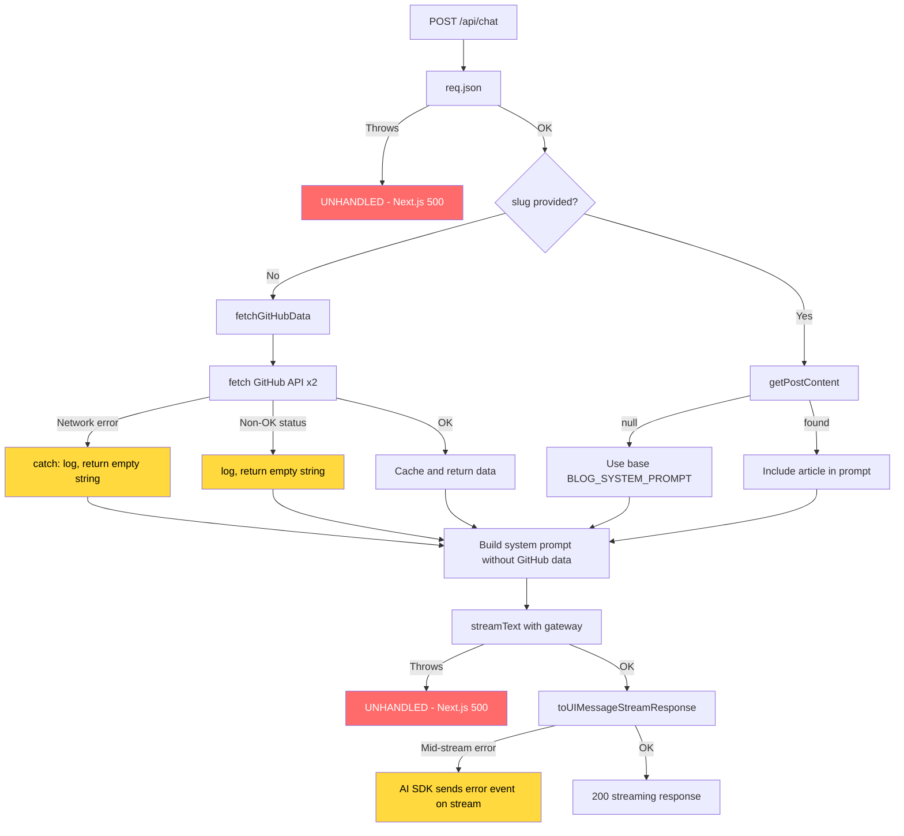
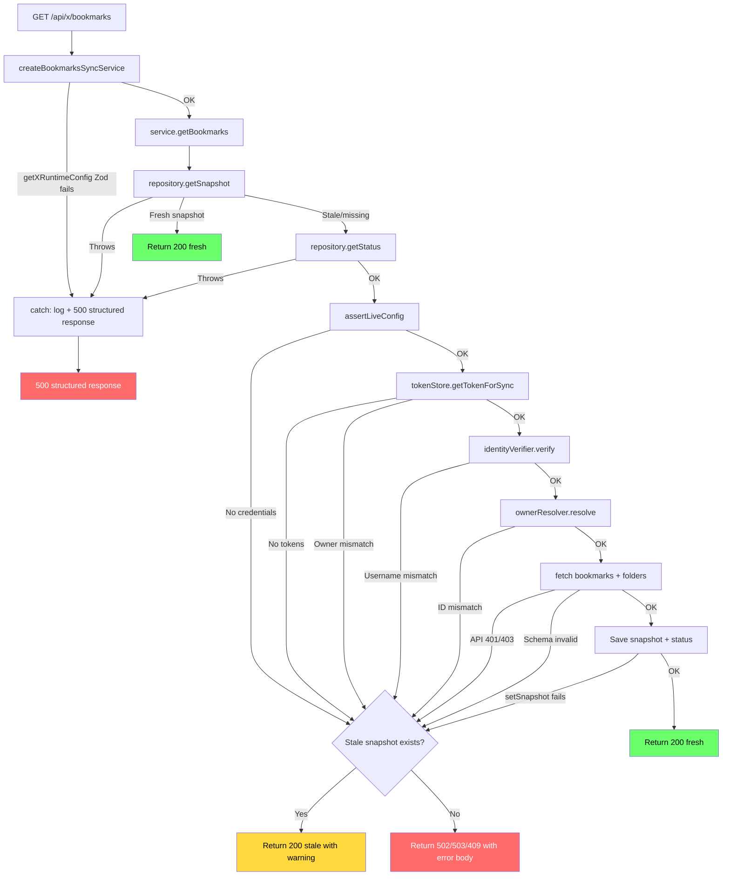
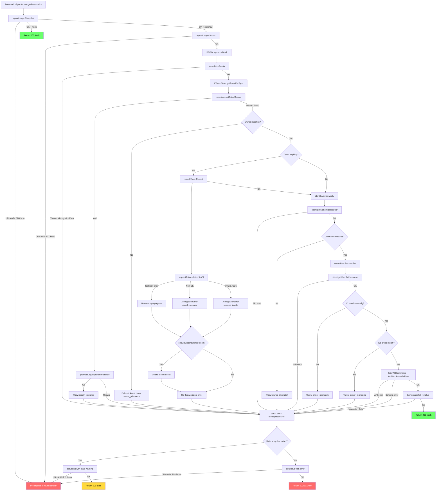

# Error Flow Analysis

Analysis of error propagation across all API route handlers and the X integration service layer.

---

## Table of Contents

1. [Redis Layer](#1-redis-layer)
2. [Chat Route](#2-chat-route-apichat)
3. [Contact Route](#3-contact-route-apicontact)
4. [Feedback Route](#4-feedback-route-apifeedback)
5. [Views Route](#5-views-route-apiviews)
6. [Clicks Route](#6-clicks-route-apiclicks)
7. [X Auth Route](#7-x-auth-route-apixauth)
8. [X Callback Route](#8-x-callback-route-apixcallback)
9. [X Bookmarks Route](#9-x-bookmarks-route-apixbookmarks)
10. [X Bookmarks Status Route](#10-x-bookmarks-status-route-apixbookmarksstatus)
11. [X Service Layer](#11-x-service-layer)
12. [X Token Store](#12-x-token-store)
13. [X Client](#13-x-client)
14. [X Cache Layer](#14-x-cache-layer)
15. [Mermaid Flowcharts](#15-mermaid-flowcharts)
16. [Cross-Cutting Issues](#16-cross-cutting-issues)

---

## 1. Redis Layer

**File**: `apps/www/lib/redis.ts`

### Error Paths

| Origin | Catch Point | Handling | Response | Classification |
|--------|-------------|----------|----------|----------------|
| `KV_REST_API_REDIS_URL` unset | Conditional check (line 8) | Returns `null`; callers fall back to in-memory | N/A (internal) | Recoverable |
| `redisClient.connect()` throws | **NONE** | Unhandled -- promise rejection propagates to caller | Caller-dependent | Terminal |
| Redis runtime errors | `redisClient.on("error")` listener (line 16) | Logged to console only; does not close or reconnect | N/A (background event) | Silent swallow |

### Issues

- **Missing error handling**: `redisClient.connect()` on line 18 is `await`ed but not wrapped in try-catch. If Redis is configured but unreachable, the connection error propagates as an unhandled rejection to whatever caller first invokes `getRedisClient()`.
- **Silent swallow**: The `on("error")` listener logs but takes no recovery action (no reconnect, no client invalidation). Subsequent calls will reuse the broken client reference because `redisClient` is never set back to `null`.

---

## 2. Chat Route (`api/chat`)

**File**: `apps/www/app/api/chat/route.ts`

### Error Paths

| Origin | Catch Point | Handling | Response | Classification |
|--------|-------------|----------|----------|----------------|
| `req.json()` fails (malformed body) | **NONE** | Unhandled; Next.js returns generic 500 | 500 (framework default) | Terminal |
| GitHub API fetch fails (network) | `catch` in `fetchGitHubData()` (line 111) | Logged; returns empty string `""` | Chat proceeds without GitHub context | Recoverable |
| GitHub API returns non-OK status | Conditional check (line 59) | Logged; returns empty string `""` | Chat proceeds without GitHub context | Recoverable |
| `getPostContent(slug)` returns null | Conditional check (line 239) | Falls back to `BLOG_SYSTEM_PROMPT` without article | Chat proceeds without article content | Recoverable |
| `streamText()` throws | **NONE** | Unhandled; Next.js returns generic 500 | 500 (framework default) | Terminal |
| `gateway()` model resolution fails | **NONE** | Unhandled; Next.js returns generic 500 | 500 (framework default) | Terminal |
| AI stream errors mid-response | Handled internally by Vercel AI SDK `toUIMessageStreamResponse` | SDK sends error event on stream | Client receives partial stream + error event | Terminal |

### Issues

- **Missing error handling**: The `POST` handler has zero try-catch blocks. Any failure in `req.json()`, `streamText()`, or model resolution will produce an unstructured 500.
- **Untyped catch**: `fetchGitHubData` catch block uses `catch (error)` with no type narrowing (line 111).

---

## 3. Contact Route (`api/contact`)

**File**: `apps/www/app/api/contact/route.ts`

### Error Paths

| Origin | Catch Point | Handling | Response | Classification |
|--------|-------------|----------|----------|----------------|
| `request.json()` fails | Outer `catch` (line 42) | Logged; returns generic error | `500 { error: "Internal server error" }` | Terminal |
| Missing required fields | Validation check (line 10) | Returns 400 immediately | `400 { error: "Missing required fields" }` | Terminal |
| Resend API returns error object | Conditional check (line 32) | Logged; returns 500 | `500 { error: "Failed to send email" }` | Terminal |
| Resend API throws exception | Outer `catch` (line 42) | Logged; returns 500 | `500 { error: "Internal server error" }` | Terminal |

### Issues

- **Untyped catch**: Outer catch uses `catch (error)` with no narrowing (line 42).
- **No input sanitization**: `message.replace(/\n/g, " ")` on user-provided HTML could allow XSS in the email body.

---

## 4. Feedback Route (`api/feedback`)

**File**: `apps/www/app/api/feedback/route.ts`

### Error Paths

| Origin | Catch Point | Handling | Response | Classification |
|--------|-------------|----------|----------|----------------|
| `request.json()` fails | Outer `catch` (line 49) | Logged; returns generic error | `500 { error: "Internal server error" }` | Terminal |
| Missing `page` or `sentiment` | Validation check (line 10) | Returns 400 | `400 { error: "Missing required fields" }` | Terminal |
| Invalid sentiment value | Validation check (line 17) | Returns 400 | `400 { error: "Invalid sentiment value" }` | Terminal |
| Resend API returns error | Conditional check (line 40) | Logged; returns 500 | `500 { error: "Failed to send feedback" }` | Terminal |
| Resend API throws | Outer `catch` (line 49) | Logged; returns 500 | `500 { error: "Internal server error" }` | Terminal |

### Issues

- **Untyped catch**: Outer catch uses `catch (error)` with no narrowing (line 49).

---

## 5. Views Route (`api/views`)

**File**: `apps/www/app/api/views/route.ts`

### Error Paths -- GET

| Origin | Catch Point | Handling | Response | Classification |
|--------|-------------|----------|----------|----------------|
| Missing `slug` query param | Validation check (line 89) | Returns 400 | `400 { error: "Missing slug parameter" }` | Terminal |
| Redis get fails | `catch` in `getViewCount` (line 36) | Logged; falls back to in-memory | `200 { slug, count }` (from memory) | Recoverable |
| Redis unavailable | Null-check in `getViewCount` (line 30) | Falls back to in-memory | `200 { slug, count }` (from memory) | Recoverable |

### Error Paths -- POST

| Origin | Catch Point | Handling | Response | Classification |
|--------|-------------|----------|----------|----------------|
| `request.json()` fails | Outer `catch` (line 163) | Returns 400 | `400 { error: "Invalid request body" }` | Terminal |
| Missing slug in body | Validation check (line 118) | Returns 400 | `400 { error: "Missing slug in request body" }` | Terminal |
| Malformed cookie JSON | Inner `catch` (line 134) | Silently treated as empty array | Proceeds normally | Recoverable |
| Redis incr fails | `catch` in `incrementViewCount` (line 61) | Logged; falls back to in-memory | `200 { slug, count }` | Recoverable |

### Issues

- **Silent swallow**: Malformed cookie catch block (line 134) has no logging -- `catch {}` with empty body.
- **Untyped catch**: Both `getViewCount` and `incrementViewCount` use `catch (err)` with no narrowing.

---

## 6. Clicks Route (`api/clicks`)

**File**: `apps/www/app/api/clicks/route.ts`

### Error Paths -- GET

| Origin | Catch Point | Handling | Response | Classification |
|--------|-------------|----------|----------|----------------|
| Redis `hGetAll` fails | `catch` (line 22) | Logged; falls back to in-memory | `200 { counts }` (from memory) | Recoverable |
| Redis unavailable | Null-check (line 8) | Falls back to in-memory | `200 { counts }` (from memory) | Recoverable |

### Error Paths -- POST

| Origin | Catch Point | Handling | Response | Classification |
|--------|-------------|----------|----------|----------------|
| `request.json()` fails | Outer `catch` (line 99) | Returns 400 | `400 { error: "Invalid request body" }` | Terminal |
| Missing/empty `ids` array | Validation check (line 38) | Returns 400 | `400 { error: "Missing or empty ids array" }` | Terminal |
| Redis unavailable | Null-check (line 56) | Falls back to in-memory | `200 { counts }` | Recoverable |
| Redis `multi().exec()` returns null | Explicit throw (line 74) | Caught by inner `catch` (line 89) | `200 { counts }` (in-memory fallback) | Recoverable |
| Redis returns NaN count | Explicit throw (line 84) | Caught by inner `catch` (line 89) | `200 { counts }` (in-memory fallback) | Recoverable |
| Redis `hIncrBy` fails | Inner `catch` (line 89) | Logged; falls back to in-memory | `200 { counts }` | Recoverable |

### Issues

- **Silent catch**: Outer `catch` on line 99 uses bare `catch {}` with no variable binding and no logging.
- **Untyped catch**: Inner catch uses `catch (err)` with no narrowing.

---

## 7. X Auth Route (`api/x/auth`)

**File**: `apps/www/app/api/x/auth/route.ts`

### Error Paths

| Origin | Catch Point | Handling | Response | Classification |
|--------|-------------|----------|----------|----------------|
| `X_OWNER_SECRET` not configured | Conditional check (line 16) | Returns 500 | `500 { error: "X_OWNER_SECRET not configured" }` | Terminal |
| Bad/missing secret param | Conditional check (line 23) | Returns 401 | `401 { error: "Unauthorized" }` | Terminal |
| `X_CLIENT_ID`/`X_CLIENT_SECRET` missing | Conditional check (line 27) | Returns 500 | `500 { error: "X_CLIENT_ID or X_CLIENT_SECRET not configured" }` | Terminal |
| `getRedisClient()` throws | **NONE** | Unhandled; Next.js 500 | 500 (framework default) | Terminal |
| Redis `set` for OAuth state fails | **NONE** | Unhandled; Next.js 500 | 500 (framework default) | Terminal |

### Issues

- **Missing error handling**: No try-catch around `getRedisClient()` or `client.set()` calls (lines 42-44). A Redis connection failure will crash the handler.
- **`getXRuntimeConfig()` can throw**: If Zod parsing of `process.env` fails, the error is unhandled.

---

## 8. X Callback Route (`api/x/callback`)

**File**: `apps/www/app/api/x/callback/route.ts`

### Error Paths

| Origin | Catch Point | Handling | Response | Classification |
|--------|-------------|----------|----------|----------------|
| OAuth `error` query param present | Conditional (line 20) | Returns 400 | `400 { error: "OAuth error: ..." }` | Terminal |
| Missing `code` or `state` | Conditional (line 27) | Returns 400 | `400 { error: "Missing code or state" }` | Terminal |
| Invalid/expired state | Conditional (line 46) | Returns 400 | `400 { error: "Invalid or expired state" }` | Terminal |
| Config not in live mode | Conditional (line 54) | Returns 500 | `500 { error: "X credentials not configured" }` | Terminal |
| `assertLiveRuntimeConfig` throws | **NONE** (outside try-catch) | Unhandled; Next.js 500 | 500 (framework default) | Terminal |
| Token exchange fails | `catch` (line 116) | Normalized via `toIntegrationError` | `400/403/500 { error }` depending on code | Terminal |
| Identity verification fails | `catch` (line 116) | Normalized via `toIntegrationError` | `400/403/500 { error }` | Terminal |
| Owner mismatch (id check) | Conditional (line 84) | Returns 403 | `403 { error: "Authenticated owner ... does not match ..." }` | Terminal |
| `repository.setStatus` fails | `catch` (line 116) | Normalized | Status-dependent HTTP code | Terminal |
| `getRedisClient()` throws | **NONE** (outside try-catch, line 36) | Unhandled | 500 (framework default) | Terminal |

### Issues

- **Missing error handling**: `getRedisClient()`, `redisClient.get()`, and `redisClient.del()` on lines 36-43 are all outside the try-catch block (which starts at line 73). Redis failures during state retrieval will crash the handler.
- **`assertLiveRuntimeConfig(config)` on line 60** can throw a plain `Error` but is outside the try-catch.

---

## 9. X Bookmarks Route (`api/x/bookmarks`)

**File**: `apps/www/app/api/x/bookmarks/route.ts`

### Error Paths

| Origin | Catch Point | Handling | Response | Classification |
|--------|-------------|----------|----------|----------------|
| `createBookmarksSyncService()` throws (config parse) | Outer `catch` (line 14) | Logged; returns structured error response | `500 { bookmarks:[], status:"upstream_error", error }` | Terminal |
| `service.getBookmarks()` throws | Outer `catch` (line 14) | Logged; returns structured error response | `500` with BookmarksApiResponse | Terminal |
| Service returns non-200 httpStatus | Passthrough (line 13) | Status code from service propagated | `{response, httpStatus}` from service | Varies |

### Issues

- **Untyped catch**: `catch (error)` with only `instanceof Error` narrowing (line 14).
- **`BookmarksApiResponseSchema.parse()` in catch block** (line 19): If this Zod parse fails (e.g., `config.ownerUserId` is malformed), it throws inside the catch, producing an unstructured 500.

---

## 10. X Bookmarks Status Route (`api/x/bookmarks/status`)

**File**: `apps/www/app/api/x/bookmarks/status/route.ts`

### Error Paths

| Origin | Catch Point | Handling | Response | Classification |
|--------|-------------|----------|----------|----------------|
| `X_OWNER_SECRET` not configured | Conditional (line 9) | Returns 500 | `500 { error: "X_OWNER_SECRET not configured" }` | Terminal |
| Bad/missing secret | Conditional (line 16) | Returns 401 | `401 { error: "Unauthorized" }` | Terminal |
| `createBookmarksSyncService()` throws | `catch` (line 24) | Logged; returns error | `500 { error }` | Terminal |
| `service.getStatus()` throws | `catch` (line 24) | Logged; returns error | `500 { error }` | Terminal |

### Issues

- **Untyped catch**: `catch (error)` with `instanceof Error` check (line 24).

---

## 11. X Service Layer

**File**: `apps/www/lib/x/service.ts` -- `BookmarksSyncService`

### `getBookmarks()` Error Flow

| Origin | Catch Point | Handling | Response | Classification |
|--------|-------------|----------|----------|----------------|
| `repository.getSnapshot()` throws | **NONE** (line 111, before try-catch) | Unhandled; propagates to route handler | Route handler's catch | Terminal |
| `repository.getStatus()` throws | **NONE** (line 122, before try-catch) | Unhandled; propagates to route handler | Route handler's catch | Terminal |
| Live config assertion fails | `catch` (line 246) | Normalized to `XIntegrationError` | Service returns `{response, httpStatus}` | Terminal |
| Token retrieval fails (no tokens) | `catch` (line 246) | Normalized; if stale snapshot exists, serves stale data | `200` (stale) or `502/503` (no snapshot) | Recoverable if stale exists |
| Identity verification fails | `catch` (line 246) | Normalized | `200` (stale) or `409` (owner mismatch) | Terminal |
| Owner mismatch (id comparison) | Explicit `throw XIntegrationError` (line 183) | `catch` (line 246) | `200` (stale) or `409` | Terminal |
| Unable to determine owner id | Explicit `throw XIntegrationError` (line 193) | `catch` (line 246) | Varies | Terminal |
| Bookmark/folder fetch fails | `catch` (line 246) | Normalized | `200` (stale) or `502` | Recoverable if stale exists |
| `repository.setSnapshot()` fails | `catch` (line 246) | Normalized (snapshot saved but status write may fail) | `200` (stale) or error | Terminal |
| `repository.setStatus()` fails inside catch | **NONE** | Unhandled; propagates up | Route handler's catch | Terminal |

### `getStatus()` Error Flow

| Origin | Catch Point | Handling | Response | Classification |
|--------|-------------|----------|----------|----------------|
| `repository.getSnapshot/getStatus/getTokenRecord` throws | **NONE** | Unhandled; propagates to route handler | Route handler's catch | Terminal |
| `BookmarksStatusApiResponseSchema.parse()` fails | **NONE** | Unhandled; propagates | Route handler's catch | Terminal |

### Issues

- **Missing error handling**: `repository.getSnapshot()` and `repository.getStatus()` calls at lines 111 and 122 happen before the try-catch block begins at line 140. If Redis throws here, it bypasses the stale-cache fallback entirely.
- **Missing error handling**: Inside the catch block (line 246), `repository.setStatus()` calls at lines 265 and 292 are not wrapped in their own try-catch. If writing status fails, the error propagates up and the caller loses the structured error response.
- **`getStatus()`** has no try-catch at all; all three parallel repository calls and the Zod parse can throw unhandled.

---

## 12. X Token Store

**File**: `apps/www/lib/x/tokens.ts` -- `XTokenStore`

### `getTokenForSync()` Error Flow

| Origin | Catch Point | Handling | Response | Classification |
|--------|-------------|----------|----------|----------------|
| No stored token and no legacy token | Explicit throw (line 78) | `XIntegrationError("reauth_required")` | Propagates to caller | Terminal |
| Stored token owner mismatch | Explicit throw (line 90) | Deletes token; throws `XIntegrationError("owner_mismatch")` | Propagates to caller | Terminal |
| Token refresh fails (fetch/parse) | `catch` in refresh block (line 100) | Discards token if terminal error code; re-throws original | Propagates to caller | Terminal |
| Legacy token promotion fails | `catch` in `promoteLegacyTokenIfPossible` (line 157) | Discards legacy token if terminal; re-throws original | Propagates to caller | Terminal |

### `requestToken()` Error Flow

| Origin | Catch Point | Handling | Response | Classification |
|--------|-------------|----------|----------|----------------|
| `fetch()` network failure | **NONE** | Unhandled; propagates as native error | Caller's catch | Terminal |
| Non-OK HTTP response | Explicit throw (line 212) | `XIntegrationError("reauth_required")` with response body | Propagates | Terminal |
| Response body not valid JSON | `catch` (line 222) | `XIntegrationError("schema_invalid")` with cause chain | Propagates | Terminal |
| JSON doesn't match schema | `catch` (line 235) | `XIntegrationError("schema_invalid")` with cause chain | Propagates | Terminal |

### Issues

- **Missing error handling**: `this.fetchImpl(...)` call on line 198 can throw a network-level error (DNS failure, timeout, etc.) that is not caught. It propagates as a raw `TypeError` rather than an `XIntegrationError`, which means `toIntegrationError()` wraps it as a generic `upstream_error`.
- **Re-throw preserves context**: The `shouldDiscardStoredToken` pattern properly inspects error codes before discarding. Re-throws preserve the original error. This is well-designed.

---

## 13. X Client

**File**: `apps/www/lib/x/client.ts`

### `readJsonResponse()` -- Central Error Handler

| Origin | Catch Point | Handling | Response | Classification |
|--------|-------------|----------|----------|----------------|
| HTTP 401/403 | Conditional (line 239) | `XIntegrationError("reauth_required")` | Propagates | Terminal |
| Other non-OK HTTP status | Conditional (line 245) | `XIntegrationError("upstream_error")` | Propagates | Terminal |
| Response not valid JSON | `catch` (line 250) | `XIntegrationError("schema_invalid")` with cause | Propagates | Terminal |

### `parseContract()` -- Schema Validation

| Origin | Catch Point | Handling | Response | Classification |
|--------|-------------|----------|----------|----------------|
| Zod parse fails | `catch` (line 37) | `XIntegrationError("schema_invalid")` with cause | Propagates | Terminal |

### `fetchBookmarkFolders()` -- Special Cases

| Origin | Catch Point | Handling | Response | Classification |
|--------|-------------|----------|----------|----------------|
| HTTP 403 or 404 | Conditional (line 177) | Returns empty array `[]` | Graceful degradation | Recoverable |

### `XBookmarksOwnerResolver.resolve()` and `XIdentityVerifier.verify()`

| Origin | Catch Point | Handling | Response | Classification |
|--------|-------------|----------|----------|----------------|
| Owner ID mismatch | Explicit throw (line 281) | `XIntegrationError("owner_mismatch")` | Propagates | Terminal |
| Username mismatch | Explicit throw (line 306) | `XIntegrationError("owner_mismatch")` | Propagates | Terminal |

### Issues

- **Missing error handling**: `this.fetchImpl(url, ...)` at line 223 can throw network-level errors that are not wrapped in `XIntegrationError`. Same issue as in the token store.

---

## 14. X Cache Layer

**File**: `apps/www/lib/x/cache.ts`

### `getValidated()` Error Flow

| Origin | Catch Point | Handling | Response | Classification |
|--------|-------------|----------|----------|----------------|
| Redis get fails | **NONE** (propagates from `getRaw`) | Unhandled; propagates to caller | Caller-dependent | Terminal |
| `JSON.parse()` fails | `catch` (line 98) | Logged; deletes corrupt key; returns `null` | `null` (treated as cache miss) | Recoverable |
| Zod `schema.parse()` fails | `catch` (line 98) | Logged; deletes corrupt key; returns `null` | `null` (treated as cache miss) | Recoverable |

### `setValidated()` Error Flow

| Origin | Catch Point | Handling | Response | Classification |
|--------|-------------|----------|----------|----------------|
| Zod `schema.parse(value)` fails | **NONE** (line 111) | Unhandled; propagates to caller | Caller-dependent | Terminal |
| Redis set fails | **NONE** (propagates from `setRaw`) | Unhandled; propagates to caller | Caller-dependent | Terminal |

### `getRaw()` / `setRaw()` / `deleteRaw()`

| Origin | Catch Point | Handling | Response | Classification |
|--------|-------------|----------|----------|----------------|
| `getRedisClient()` throws | **NONE** | Propagates | Caller-dependent | Terminal |
| Redis command fails | **NONE** | Propagates | Caller-dependent | Terminal |

### Issues

- **Missing error handling**: All raw Redis operations (`getRaw`, `setRaw`, `deleteRaw`) have zero error handling. Redis failures propagate as-is.
- **`setValidated` double-validates**: Calls `schema.parse(value)` to validate before storing, but if it throws, the Zod error propagates unhandled.

---

## 15. Mermaid Flowcharts

### Chat Route Error Flow

### X Bookmarks Route Error Flow

### Bookmark Sync Service Internal Error Flow

---

## 16. Cross-Cutting Issues

### Silent Swallows

| Location | Description |
|----------|-------------|
| `redis.ts:16` | `on("error")` handler logs but never invalidates `redisClient`, so broken connections persist silently |
| `views/route.ts:134` | `catch {}` for malformed cookie -- empty catch body, zero logging |
| `clicks/route.ts:99` | `catch {}` for invalid request body -- empty catch body, zero logging |
| `chat/route.ts:111` | GitHub fetch failures logged but silently degrade to empty context |
| `x/oembed.ts:72` | `fetchOEmbed` returns `null` on non-OK responses with no logging |

### Untyped Catches

| Location | Pattern |
|----------|---------|
| `chat/route.ts:111` | `catch (error)` -- no narrowing |
| `contact/route.ts:42` | `catch (error)` -- no narrowing |
| `feedback/route.ts:49` | `catch (error)` -- no narrowing |
| `views/route.ts:36,61` | `catch (err)` -- no narrowing |
| `clicks/route.ts:22,89` | `catch (err)` -- no narrowing |
| `x/bookmarks/route.ts:14` | `catch (error)` -- `instanceof Error` check only |
| `x/bookmarks/status/route.ts:24` | `catch (error)` -- `instanceof Error` check only |
| `x/cache.ts:98` | `catch (error)` -- no narrowing |

### Missing Error Handling (No try-catch Around Async Operations That Can Fail)

| Location | Risk |
|----------|------|
| `chat/route.ts` -- entire POST handler | `req.json()`, `streamText()`, `gateway()` all unwrapped |
| `x/auth/route.ts:42-48` | `getRedisClient()` and `client.set()` unwrapped |
| `x/callback/route.ts:36-43` | `getRedisClient()`, `client.get()`, `client.del()` unwrapped |
| `x/callback/route.ts:60` | `assertLiveRuntimeConfig()` outside try-catch |
| `redis.ts:18` | `redisClient.connect()` unwrapped |
| `x/service.ts:111-125` | `repository.getSnapshot()` and `repository.getStatus()` before try-catch |
| `x/service.ts:265,292` | `repository.setStatus()` inside catch block -- if it throws, structured error response is lost |
| `x/service.ts:313-351` | `getStatus()` has no try-catch at all |
| `x/tokens.ts:198` | `this.fetchImpl(...)` can throw `TypeError` on network failure |
| `x/client.ts:223` | `this.fetchImpl(...)` same issue |

### Re-throws That Lose Context

| Location | Description |
|----------|-------------|
| `x/errors.ts:35` | `toIntegrationError` for non-Error values creates a generic "Unknown X integration error" message, losing the original value entirely |

### Error Normalization Quality

The X integration layer has a well-designed error normalization pattern via `XIntegrationError`, `toIntegrationError()`, and `toIntegrationIssue()`. Error codes are mapped to HTTP statuses and API response statuses consistently. The main gap is that network-level `TypeError` exceptions from `fetch()` are not pre-wrapped, so they arrive at `toIntegrationError()` as plain `Error` instances and get classified as generic `upstream_error` without the more specific context that a purpose-built catch could provide.
