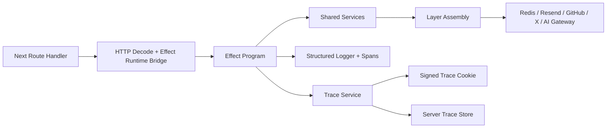

# API Modernization Input Review: Principal Architecture

Date: 2026-03-12
Status: archived
Type: input-review
Audience: principal engineering review
Topic: api-modernization
Canonical: no
Superseded by: ../principal-engineer-roadmap-A.md

## Archived Input

This document is preserved as a principal-review framing input. The canonical
implementation-facing direction for this topic is
[principal-engineer-roadmap-A.md](../principal-engineer-roadmap-A.md).

## Principal Review Framing

### Architectural Problem

The current API works, but it is not yet organized as a coherent program model. Each route decides its own validation style, dependency access pattern, fallback behavior, and logging shape. That creates local convenience at the cost of system-wide readability, testability, and coordination.

### Why This Matters Now

- the repository is already large enough that route-by-route variance will slow future changes
- the requested Effect adoption requires explicit dependency and error boundaries
- client-visible traceability is not safe to add on top of the current ad hoc logging model
- parallel migration reports will create conflicting recommendations unless the architecture is normalized now

### Decisions Requested From Principal Review

1. Standardize on a single route architecture pattern for all API features.
2. Treat `Effect.Schema` as the default schema system for new and migrated API modules.
3. Restrict trace cookies to correlation metadata and keep full trace state in Redis or equivalent server-side storage.
4. Require a real package-level test harness before broad route migration begins.

## Current-State Findings

### 1. Route handlers fuse transport, validation, business logic, and infrastructure

Evidence:

- `apps/www/app/api/views/route.ts`
- `apps/www/app/api/clicks/route.ts`
- `apps/www/app/api/contact/route.ts`
- `apps/www/app/api/feedback/route.ts`
- `apps/www/app/api/x/*`
- `apps/www/app/api/chat/route.ts`

Impact:

- duplicated patterns
- hard-to-test flows
- no single interception point for logging, tracing, or error mapping

### 2. Validation and contracts are ad hoc

Evidence:

- raw `request.json()` decoding is used directly in multiple routes
- missing-field checks are hand-written
- request, response, and cookie shapes are not centralized

Impact:

- inconsistent 400 behavior
- no shared contract reuse
- difficult malformed-input coverage

### 3. Error handling and observability are too weak for traceability

Evidence:

- failures are collapsed to string messages or generic 500 responses
- logging is primarily `console.error`
- there is no consistent request id, trace id, region id, span annotation, or typed error channel

Impact:

- client-visible trace flows cannot be made safe or useful without redesign
- production debugging depends on manual log reading
- peers will otherwise invent incompatible error and trace models

### 4. Mutable module state reduces determinism

Evidence:

- `apps/www/lib/redis.ts`
- `apps/www/lib/x/cache.ts`
- `apps/www/lib/x/tokens.ts`
- module-level GitHub cache in `apps/www/app/api/chat/route.ts`

Impact:

- behavior depends on process lifetime
- local fallbacks are implicit instead of modeled
- testing expiry, fallback, and caching paths is harder than it should be

### 5. Test infrastructure is functionally absent

Evidence:

- `turbo.json` defines a monorepo `test` task
- `apps/www/package.json` does not define a `test` script
- `packages/link-checker/package.json` does not define a `test` script
- `pnpm test` reports that no tasks were executed

Impact:

- the repo gives a false signal of safety
- migration risk is materially higher than it appears
- peer reports that assume a working test baseline will be misleading

### 6. Existing cookie use is too narrow for execution tracing

Evidence:

- `apps/www/app/api/views/route.ts` stores a JSON list of viewed slugs for deduplication

Impact:

- there is no reusable cookie schema
- there is no signing, redaction, trace lookup, or region/event model
- storing full execution state in cookies would be unsafe and operationally expensive

## Debt Register

| Debt | Evidence | Current Cost | Migration Cost | Priority |
| --- | --- | --- | --- | --- |
| No shared route architecture | Route-local transport, validation, infra, and fallback logic | High | High | P0 |
| No shared schema layer | Manual field checks and implicit contracts | High | High | P0 |
| No typed error vocabulary | Generic error strings and inconsistent 500 behavior | High | High | P0 |
| No structured logging or spans | `console.error` and route-local logging only | High | High | P0 |
| No real test harness | `pnpm test` executes no tasks | Very High | Very High | P0 |
| Global mutable fallback state | In-memory caches and singleton infra state | Medium | High | P1 |
| No reusable trace model | Cookie logic is endpoint-specific | High | High | P1 |
| Inconsistent module documentation | Some modules are documented, many are not | Medium | Medium | P1 |
| Direct env access throughout route code | Hidden runtime assumptions | Medium | Medium | P1 |

## Options and Tradeoffs

### Reusable Comparison Rubric

All peer reports should use this rubric exactly.

| Dimension | Preferred Direction | Interpretation |
| --- | --- | --- |
| Delivery speed | Higher | Faster to ship safely |
| Migration risk | Lower | Less chance of regressions during adoption |
| Operational risk | Lower | Less risk in production behavior and observability gaps |
| Long-term maintainability | Higher | More consistent, easier future change |
| Testability | Higher | Easier deterministic coverage across layers |
| Observability | Higher | Better traceability, logging, and debugging |
| Org complexity | Lower | Less coordination and training overhead |

### Option Comparison

| Option | Delivery Speed | Migration Risk | Operational Risk | Long-Term Maintainability | Testability | Observability | Org Complexity |
| --- | --- | --- | --- | --- | --- | --- | --- |
| A. Pragmatic hardening without Effect | High | Low | Medium | Low | Medium | Medium | Low |
| B. Hybrid Effect core with Next adapters | Medium | Medium | Low | High | High | High | Medium |
| C. Full Effect-first platform rewrite | Low | High | Medium | Very High | Very High | Very High | High |

### Option A: Pragmatic Hardening Without Effect

Approach:

- keep `async/await` route implementations
- add validation and logging improvements without adopting a full Effect program model

Strengths:

- lowest short-term delivery cost
- easiest for teams unfamiliar with Effect

Weaknesses:

- misses the stated architecture goal
- preserves route-level variance
- likely causes duplicate migration work later

Coordination impact:

- peers may still propose incompatible abstractions because the route model remains informal

### Option B: Hybrid Effect Core With Next Adapters

Approach:

- keep Next route handlers as thin adapters
- implement route logic as `Effect` programs with shared services, schemas, typed errors, and tracing

Strengths:

- best balance of architectural consistency and migration cost
- supports one reusable implementation model across peer workstreams
- improves testing and observability before the most complex migrations

Weaknesses:

- requires team alignment on Effect concepts
- introduces temporary mixed style while migration is underway

Coordination impact:

- shared abstractions can be defined once and reused by all peers

### Option C: Full Effect-First Platform Rewrite

Approach:

- move all route behavior into a new platform-wide Effect API layer immediately

Strengths:

- strongest long-term consistency
- maximizes eventual testability and observability

Weaknesses:

- highest migration risk
- likely disproportionate to the current app size and route complexity
- introduces the most organizational and sequencing risk across peer workstreams

Coordination impact:

- centralizes everything, but forces all peer reports to depend on the same large foundational rewrite

## Recommended Path

Choose Option B.

### Target Architecture

### Shared Abstractions To Coordinate

These abstractions should be defined once and reused across peer workstreams:

- `Config` service
- error vocabulary and error envelope mapping
- trace event schema
- trace cookie schema
- logging annotations and span naming
- request context service
- test harness conventions
- `Layer` naming and service boundary conventions
- route adapter contract for Next handlers

### Platform-Wide Work To Centralize

- shared runtime bridge from Next route handlers into Effect programs
- typed config loading and environment access
- shared error types and public error response mapping
- trace event model, redaction rules, and cookie pointer format
- structured logging conventions
- test harness bootstrap and package-level test scripts

### API-Specific Work To Decentralize

- analytics route migration
- email route migration
- X OAuth and bookmark route migration
- chat route migration
- route-local domain rules and route-local schema details

### Module Docstring Standard

Every route, program, and infrastructure module used by the API should start with a short docstring covering:

- purpose
- execution regions
- required services
- typed errors
- entrypoints

This is required so peers describe modules with the same structure and the principal can compare proposed abstractions without reading each implementation in detail.

### Implementation Sequence

1. Establish the shared route architecture and foundational abstractions.
2. Add the real package-level test harness and CI-visible `test` scripts.
3. Migrate analytics routes first to prove tracing, cookies, and storage layers.
4. Migrate email routes next because they are operationally simpler than chat and X OAuth.
5. Migrate X flows after token, expiry, and trace policies are stable.
6. Migrate chat last because it has the widest external surface and the strictest redaction needs.

## Dependencies on Other Workstreams

### Cross-Report Dependencies

This report depends on parallel peer work to align on:

- one shared config-loading model
- one shared error taxonomy
- one shared trace event and cookie schema
- one shared logging and annotation model
- one shared test-layer vocabulary
- one shared rollout sequence

### Integration Touchpoints

Peer reports should identify the same touchpoints explicitly:

- Next route adapter boundary
- Redis-backed state and trace storage
- external service gateways such as Resend and AI providers
- cookie encoding and signing boundary
- client trace viewer endpoint and UI contract

### Sequencing Constraints

- do not migrate route implementations independently before the shared route architecture is approved
- do not let peers define separate trace event formats per subsystem
- do not let route-specific work begin before the package-level test harness is in place

### Coordination Guidance For Peers

All peer reports should use this section order:

1. Executive summary
2. Current-state findings
3. Debt register
4. Options and tradeoffs
5. Recommended path
6. Dependencies on other workstreams
7. Test and rollout expectations
8. Open decisions for principal review

All peer reports should use this vocabulary:

- `P0`, `P1`, `P2` for priority
- `low`, `medium`, `high` for migration risk
- `shared foundation`, `local implementation`, `cross-cutting concern` for ownership
- `required`, `recommended`, `optional` for rollout items

All peer reports should declare these assumptions explicitly:

- expected runtime environment
- whether Effect adoption is mandatory or gradual
- whether Redis remains a platform dependency
- whether tracing data can be exposed to end users
- whether current response shapes must remain backward compatible

All peer reports should contribute to these shared artifacts:

- one glossary for Effect, trace, and testing terms
- one dependency matrix naming owners for shared abstractions
- one list of platform-level decisions that must be made once
- one rollout sequence that avoids conflicting implementation order

Peers should explicitly avoid:

- inventing separate error taxonomies
- proposing different schema libraries without a coexistence plan
- redefining trace event structure independently
- changing public response shapes without calling it out in a consistent format
- assuming ownership of shared infrastructure without naming the owner

## Test and Rollout Expectations

### Required Test Harness Changes

- add package-level `test` scripts to all active workspace packages
- keep root testing delegated through `turbo run test`
- add a route-oriented test setup for `apps/www`
- add coverage reporting so migration quality is visible in CI

### Required Test Layers

| Layer | Expectation |
| --- | --- |
| Schema tests | Validate request, response, cookie, and trace payload contracts |
| Domain tests | Cover route-local decision logic without infrastructure |
| Service tests | Run Effect programs against fake `Layer`s |
| Time tests | Use deterministic time for expiry, TTL, and dedup windows |
| Route integration tests | Verify Next handler request/response behavior |
| End-to-end tests | Verify trace cookie flow and selected client-visible interactions |

### Rollout Expectations

Required:

- shared abstractions approved before route-by-route migrations
- package-level test harness in place before major migrations
- trace redaction rules approved before client-visible trace rollout

Recommended:

- analytics route as the proving ground
- email routes before OAuth and chat
- route migration only after docstrings and contracts are defined

Optional:

- preview-only trace viewer before broader rollout
- temporary coexistence helpers for legacy route patterns

### Acceptance Criteria

- the recommended path can be compared line-by-line with peer recommendations
- every migrated route uses the same route architecture pattern
- shared abstractions have named owners
- trace behavior is safe, typed, and testable
- CI executes real tests instead of a no-op monorepo task

## Open Decisions for Principal Review

These decisions should be made once and shared across all reports.

| Decision | Recommended Default | Why |
| --- | --- | --- |
| Standard schema system | `Effect.Schema` | Aligns contracts with the target program model |
| Trace exposure policy | Restrict to preview, development, or admin-only initially | Minimizes data exposure risk while the trace model matures |
| Trace backing store | Redis-backed short-lived trace state | Matches current platform usage and avoids oversized cookies |
| Route architecture standard | One shared Next adapter + Effect program pattern | Prevents peers from proposing incompatible route designs |

## Review Checklist for Principal

- does the recommendation converge on one route architecture for all API features
- does the plan reduce migration risk before broad adoption
- does it align with the other peer reports using the same rubric and vocabulary
- does it minimize duplicated platform work across workstreams
- does it define measurable acceptance criteria and ownership boundaries

## Assumptions

- “rename it” refers to the report title and filename, not code symbols
- the principal will review multiple reports in parallel and needs consistency first
- this document remains the API-focused report and should coordinate with, not replace, platform-wide reports
- a shared reporting template across peer workstreams is preferable to local formatting choices

## Evidence Base

This report is based on direct inspection of:

- `apps/www/app/api/chat/route.ts`
- `apps/www/app/api/views/route.ts`
- `apps/www/app/api/clicks/route.ts`
- `apps/www/app/api/contact/route.ts`
- `apps/www/app/api/feedback/route.ts`
- `apps/www/app/api/x/auth/route.ts`
- `apps/www/app/api/x/callback/route.ts`
- `apps/www/app/api/x/bookmarks/route.ts`
- `apps/www/lib/redis.ts`
- `apps/www/lib/x/cache.ts`
- `apps/www/lib/x/tokens.ts`
- `apps/www/package.json`
- `packages/link-checker/package.json`
- `turbo.json`
