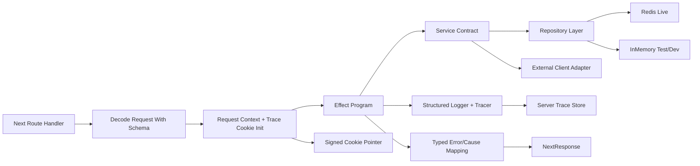

# API Modernization Synthesis

Date: 2026-03-12
Status: supporting
Type: synthesis
Audience: engineering team
Topic: api-modernization
Canonical: no
Derived from: evidence.md, benchmark.md, inputs/effect-migration-review.md, inputs/principal-architecture-review.md
Superseded by: principal-engineer-roadmap-A.md

## Executive Summary

The current API surface is small enough to migrate deliberately, but it is not yet organized as a coherent server subsystem. Route handlers currently mix transport, validation, business logic, storage fallback, external IO, and logging. That works for the current scope, but it blocks the three stated goals:

- `Effect` adoption is hard because dependencies and failure channels are implicit.
- comprehensive testing is hard because the units are not isolated and there is no package-level harness in `apps/www`.
- cookie-enabled trace visibility is unsafe to layer on top of ad hoc `console.error` logging and route-local JSON parsing.

The recommended direction is a hybrid `Effect` architecture:

- keep Next.js route handlers as thin HTTP adapters
- move route logic into `Effect` programs
- define request, response, cookie, and trace contracts with `Schema`
- inject storage, external clients, config, clock, and logging with `Layer`
- use `FiberRef` plus tracing spans for request-scoped context
- use cookies only for signed correlation metadata and optional compact breadcrumbs, not as the primary log store

This synthesis now serves as the architecture background for the topic.
Execution priorities, phase sequencing, dependency gates, and artifact cleanup
are owned by
[principal-engineer-roadmap-A.md](./principal-engineer-roadmap-A.md). Supporting
repo evidence lives in [evidence.md](./evidence.md), the external-source
benchmark lives in [benchmark.md](./benchmark.md), and archived contributor
inputs live in [inputs/](./inputs/).

## Roadmap Ownership

Use [principal-engineer-roadmap-A.md](./principal-engineer-roadmap-A.md) for:

- requirement prioritization
- phase sequencing and exit criteria
- first-sprint and migration ordering
- artifact cleanup and canonical document status

## Current-State Diagnosis

### Structural issues

- Route handlers own too many concerns at once. `views`, `clicks`, `contact`, `feedback`, `chat`, and `x/*` all parse input, branch on errors, call infra directly, and return responses from the same file.
- Runtime contracts are implicit. Most routes call `await request.json()` and then rely on hand-written `if (!field)` checks instead of a shared schema layer.
- Error handling is stringly typed. Failures are rendered as generic JSON messages and logged with `console.error`, which prevents typed assertions and structured trace playback.
- Hidden dependencies are widespread. Direct `process.env` access, singleton Redis clients, module-level caches, and in-memory fallbacks are embedded throughout the route surface.
- The repo advertises a `test` task, but the app package has no `test` script and there are no API tests in the workspace.

### Why this matters for the requested goals

- `Effect` needs explicit environment requirements and typed failures to pay off.
- trace cookies need a request context and a stable event model; otherwise they become unsafe state dumps.
- a broad migration without tests will turn every route refactor into manual regression checking.

## Findings by Subsystem

### Chat

- The server trusts a client-provided model identifier and forwards it directly to `gateway(model)`, while the allowlist exists only in the client hook/UI model list.
- The route contains request parsing, blog-content loading, GitHub context fetching, prompt construction, and stream startup in one file.
- The route streams the response. Because Next.js cookie mutation must happen before streaming starts, any trace-cookie design for chat must set the pointer cookie before `toUIMessageStreamResponse()`.

### Clicks and views

- `clicks` and `views` both depend on the same in-memory store fallback, which does not match production storage isolation.
- `views` mixes query/body parsing, storage IO, and cookie dedupe logic in one route file.
- The current `viewed_pages` cookie stores only slugs, not per-slug timestamps, so it does not model true per-page 24-hour dedupe.
- The client hooks already define observable behavior that the server design must preserve:
  - `useClickCountEngine` batches client events and uses `sendBeacon` on tab hide.
  - `usePageViews` silently fails analytics fetch errors instead of breaking rendering.

### Contact and feedback

- Both routes instantiate `Resend`, parse JSON, validate minimal fields, compose email bodies, and return response JSON inline.
- Both routes interpolate raw user input into HTML email bodies.
- Neither route has a reusable schema, redaction policy, or typed failure vocabulary.

### X auth and bookmarks

- `/api/x/auth` uses a query-string secret for an owner-only privileged flow.
- `/api/x/callback` mixes state lookup, config lookup, token exchange, token persistence, and redirect behavior.
- `/api/x/bookmarks` conditionally serves fixture data whenever credentials are missing, without restricting that behavior to local or preview environments.
- Token storage, bookmark cache, and X client code already form a natural service boundary, but they are not expressed as explicit contracts.

### Shared runtime

- Redis access is centralized, but still exposed as a singleton client plus a single shared in-memory `Map`.
- The X token/cache helpers and the chat GitHub cache use module-level mutable state, which is convenient for runtime behavior and awkward for deterministic tests.
- There is no common request context, trace id, logger, or route runner abstraction.

The detailed evidence and route-by-route matrix are in
[evidence.md](./evidence.md).

## Evaluation Rubric

Use this rubric to compare the options below and any future amendments to the
plan.

| Dimension | Preferred direction | Interpretation |
| --- | --- | --- |
| Delivery speed | Higher | Faster to ship safely |
| Migration risk | Lower | Less chance of regressions during adoption |
| Operational risk | Lower | Less risk in production behavior and debugging |
| Long-term maintainability | Higher | More consistent future changes |
| Testability | Higher | Easier deterministic coverage across layers |
| Observability | Higher | Better traceability and incident debugging |
| Org complexity | Lower | Less coordination and training overhead |

## Goal-Area Options and Tradeoffs

### 1. `Effect` adoption path

| Option | Description | Strengths | Weaknesses | Decision |
| --- | --- | --- | --- | --- |
| A. Minimal service extraction | Move business logic into plain service functions first, add `Effect` later | Lowest short-term churn | Duplicates migration work and delays error/env normalization | Reject |
| B. Hybrid `Effect` core behind Next adapters | Keep `route.ts` files thin and move logic into `Effect` services, contracts, and layers | Best balance of rigor, cost, and consistency | Requires introducing shared runtime abstractions up front | Preferred |
| C. Dedicated package extraction | Move the whole server core into `packages/api-core` immediately | Strongest boundaries | Highest initial cost and unnecessary packaging churn while there is only one consumer | Fallback only if multi-app reuse becomes a near-term requirement |

### 2. Testing architecture

| Option | Description | Strengths | Weaknesses | Decision |
| --- | --- | --- | --- | --- |
| A. Plain Vitest route tests only | Add app-level tests that hit route adapters | Fastest initial setup | Misses service, schema, and repository contract coverage | Reject |
| B. Layered Vitest + `@effect/vitest` + property tests | Add contract, service, repository, route-adapter, and property tests | Covers migration risk at every layer | Higher initial setup cost | Preferred |
| C. Route tests first, then layered tests | Start with route smoke tests and add deeper layers later | Lower initial effort than B | Likely leaves core abstractions untested during migration | Fallback if schedule is constrained |

### 3. Trace/log visibility architecture

| Option | Description | Strengths | Weaknesses | Decision |
| --- | --- | --- | --- | --- |
| A. Full trace in cookie | Store event payloads directly in cookies | No server trace store needed | Unsafe, size-constrained, leaks too much data, expensive on every request | Reject |
| B. Signed cookie pointer + server trace store + optional breadcrumb cookie | Cookie carries correlation metadata; full events live server-side with TTL | Safe, scalable, works for streaming routes if cookie is set before stream start | Requires a trace repository and lookup UI or endpoint | Preferred |
| C. Header-only correlation and no cookie | Keep tracing entirely server-side | Simplest operational model | Does not meet the explicit client-visible cookie requirement | Fallback only if product scope changes |

## Recommended Architecture

### Operational model



### Module boundary standard

- `app/api/**/route.ts`
  Purpose: transport adapters only.
- `lib/server/contracts/**`
  Purpose: request, response, cookie, trace, and config schemas.
- `lib/server/errors/**`
  Purpose: tagged API, domain, and infrastructure error families.
- `lib/server/runtime/**`
  Purpose: request context, trace cookie helpers, route runner, logger, config, time.
- `lib/server/services/**`
  Purpose: route-facing `Effect` programs.
- `lib/server/repos/**`
  Purpose: storage and trace repositories behind shared interfaces.
- `lib/server/adapters/**`
  Purpose: Resend, AI Gateway, GitHub, and X client bridges.

### Module docstring standard

Every non-trivial server module should begin with a docstring that states:

- responsibility
- public API
- dependencies
- logical regions
- failure model
- observability contract

Recommended template:

```ts
/**
 * Module: views/service
 *
 * Responsibility:
 *   Deduplicate and increment page views.
 *
 * Public API:
 *   - trackView(input): Effect<ViewResult, ViewsError, ViewsEnv>
 *   - getViewCount(slug): Effect<number, ViewsError, ViewsEnv>
 *
 * Dependencies:
 *   - ViewsRepo
 *   - Clock
 *   - TraceLog
 *   - Cookies
 *
 * Regions:
 *   - views.decode
 *   - views.read-cookie
 *   - views.check-duplicate
 *   - views.increment
 *   - views.write-cookie
 *
 * Failure model:
 *   - InvalidSlug
 *   - CookieDecodeError
 *   - StorageUnavailable
 */
```

## Target Interfaces to Adopt

These are report-level target interfaces. They are not implemented in this phase, but they are specific enough that implementation should not need to invent them.

### Shared request and trace contracts

```ts
type RequestContext = {
  requestId: string
  traceId: string
  route: string
  method: string
  startedAt: number
  traceMode: "off" | "summary" | "full"
}

type TraceCookiePointer = {
  v: 1
  traceId: string
  mode: "summary" | "full"
  issuedAt: number
  expiresAt: number
}

type TraceEvent = {
  traceId: string
  requestId: string
  route: string
  region: string
  outcome: "success" | "failure"
  startedAt: number
  endedAt: number
  errorTag?: string
  annotations: Record<string, string | number | boolean | null>
}
```

Implementation defaults:

- the cookie stores a signed serialized `TraceCookiePointer`, not raw event data
- full trace events are written to a server-side trace repository with TTL
- annotations must be redacted before persistence
- chat sets the trace cookie before streaming begins

### Shared error families

```ts
type ApiDecodeError = { _tag: "ApiDecodeError"; issues: unknown[] }
type AuthError = { _tag: "AuthError"; reason: "missing" | "invalid" | "expired" }
type DomainError = { _tag: "DomainError"; code: string; message: string }
type ExternalServiceError = { _tag: "ExternalServiceError"; service: "redis" | "resend" | "github" | "x" | "ai"; detail: string }
type TracePolicyError = { _tag: "TracePolicyError"; reason: "disabled" | "tampered" | "oversize" }
```

Implementation defaults:

- route handlers map decode errors to `400`
- auth failures map to `401` or `403`
- domain errors map to route-specific `4xx`
- external service failures map to `502` or `503` where the failure is upstream, and `500` only for internal invariants

### Shared route runner contract

```ts
type RouteRunnerSpec<Input, Output, Error, Env> = {
  name: string
  decode: (request: Request) => Effect.Effect<Input, ApiDecodeError>
  execute: (input: Input) => Effect.Effect<Output, Error, Env>
  encode: (output: Output, ctx: RequestContext) => Response
  encodeError: (error: Error | ApiDecodeError, ctx: RequestContext) => Response
}
```

Required behavior:

- initialize request context
- initialize trace pointer cookie when trace mode is enabled
- wrap logical regions with tracing helpers
- log typed exits
- map `Exit` to HTTP consistently

### Service contracts

| Service | Responsibility | Inputs | Outputs | Failure channel | Environment dependencies |
| --- | --- | --- | --- | --- | --- |
| `ViewsService` | read and conditionally increment page views with dedupe | slug, existing view cookie, now | count, duplicate flag, next cookie state | decode, cookie, storage | views repo, clock, trace log |
| `ClicksService` | tally click ids and persist counts | ids[] | counts by id | decode, storage | clicks repo, trace log |
| `ContactService` | validate and send contact form payload | name, email, message | success receipt | decode, validation, email provider | resend adapter, config, trace log |
| `FeedbackService` | validate and send page feedback payload | page, sentiment, message | success receipt | decode, validation, email provider | resend adapter, config, trace log |
| `ChatService` | build prompt context and start model stream | messages, slug?, model, webSearch | stream handle + metadata | decode, policy, upstream AI/GitHub/blog | AI adapter, GitHub adapter, blog loader, trace log |
| `XAuthService` | bootstrap and complete OAuth/token flows | owner auth input, callback params | redirect or token persistence result | auth, config, storage, upstream X | token repo, state repo, X adapter, trace log |
| `XBookmarksService` | fetch and cache bookmarks/folders | optional folder id | bookmarks, folders, cache metadata | auth, storage, upstream X | bookmarks repo, cache repo, X adapter, trace log |

### Repository contracts

| Repository | Responsibility | Live backing | Test/dev backing |
| --- | --- | --- | --- |
| `ViewsRepo` | get/increment page views | Redis string keys | isolated in-memory map |
| `ClicksRepo` | get/tally click counts | Redis hash | isolated in-memory map |
| `TraceRepo` | persist/query trace events by trace id | Redis TTL keys | isolated in-memory map with expiry shim |
| `XTokenRepo` | store and refresh token state | Redis JSON value | in-memory token state |
| `XCacheRepo` | cache bookmark/folder payloads | Redis TTL keys | in-memory TTL cache |

The detailed code evidence is in [evidence.md](./evidence.md). The external
benchmark and source notes are in [benchmark.md](./benchmark.md).
