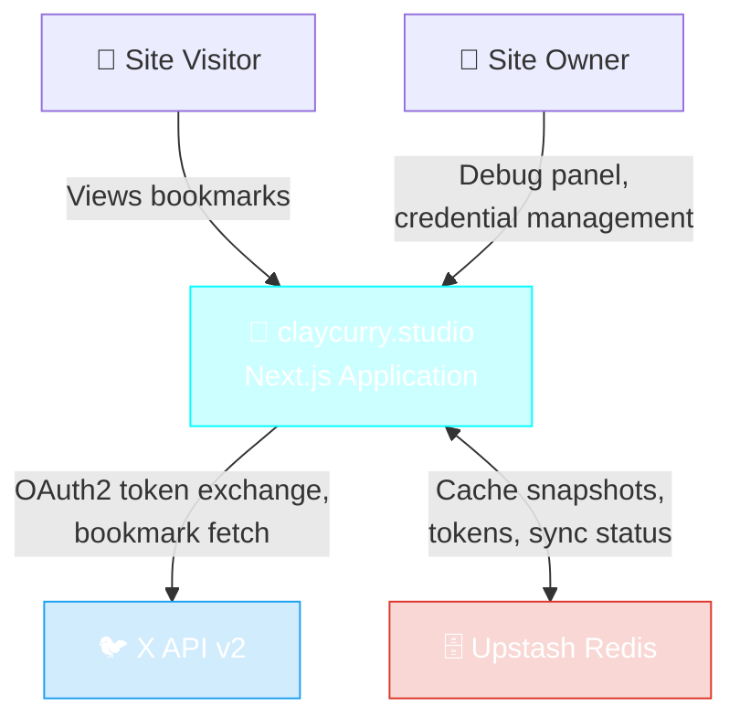
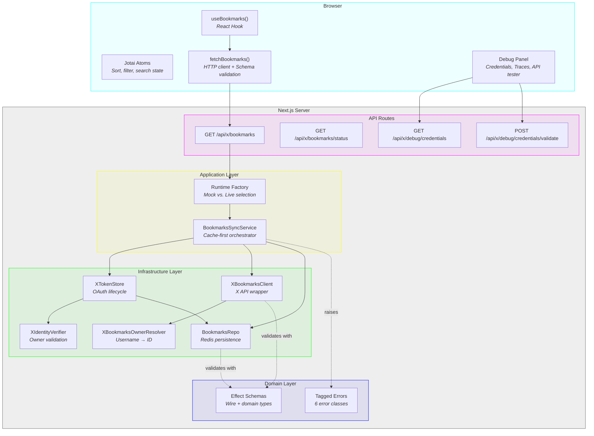
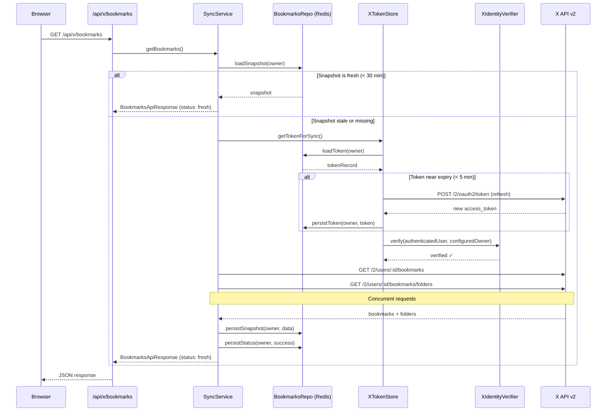
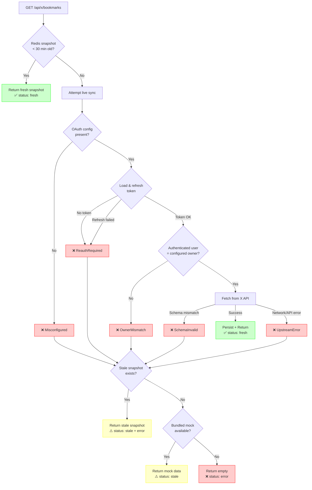
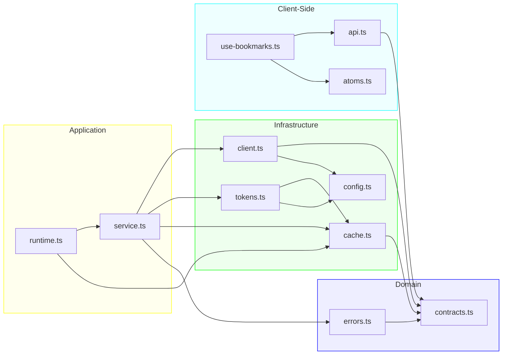
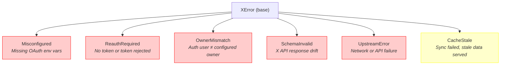
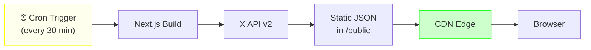
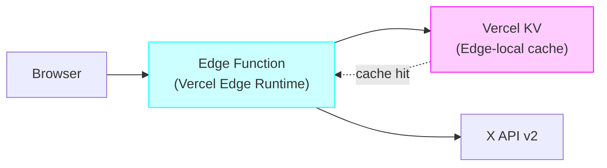
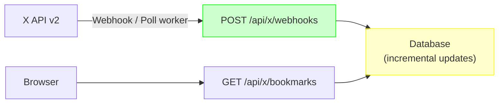
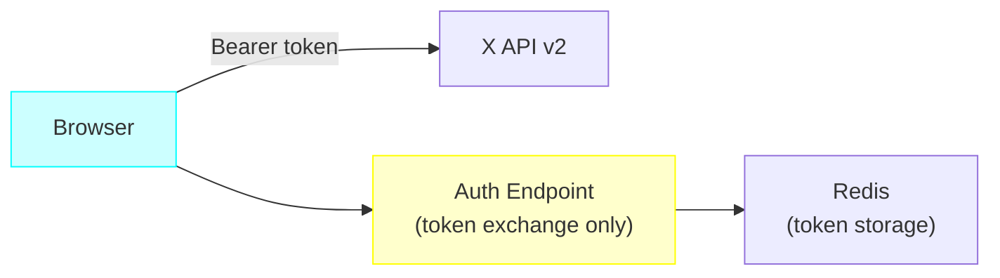

# X Bookmarks — High-Level Design

## 1. Overview

### Problem Statement

The portfolio site at claycurry.studio displays the owner's curated X (Twitter) bookmarks as a content feed. X's API imposes OAuth2 token management, rate limits, and schema volatility — none of which should leak into the user experience. The system must sync bookmarks reliably, degrade gracefully when the upstream API is unavailable, and remain easy to debug in production.

### Goals

| # | Goal | Rationale |
|---|------|-----------|
| G1 | Display bookmarks from the configured owner only | Prevents token/owner mismatch from surfacing foreign content |
| G2 | Never blank the UI on sync failure | Stale data is better than an empty page |
| G3 | Validate every external contract at runtime | X API responses evolve without notice; schemas catch drift early |
| G4 | Keep the cache boundary replaceable | Enables future migration from Redis to push-based or disk-backed storage |
| G5 | Provide deep observability for production debugging | Token health, sync timing, cache age, and distributed traces |

---

## 2. Requirements

### 2.1 Functional Requirements

| ID | Requirement | Status |
|----|-------------|--------|
| FR-1 | Fetch and normalize bookmarks from X API v2 (`/2/users/:id/bookmarks`) | Implemented |
| FR-2 | Fetch bookmark folders via `/2/users/:id/bookmarks/folders` | Implemented |
| FR-3 | Auto-paginate through all bookmarks using cursor-based pagination | Implemented |
| FR-4 | Normalize X API wire format (snake_case) to domain model (camelCase) | Implemented |
| FR-5 | OAuth2 token exchange (authorization code + PKCE) | Implemented |
| FR-6 | Automatic token refresh within a 5-minute window before expiry | Implemented |
| FR-7 | Owner identity verification — authenticated user must match `X_OWNER_USERNAME` | Implemented |
| FR-8 | Cache snapshots in Redis with 30-minute freshness window | Implemented |
| FR-9 | Serve stale snapshot when live sync fails | Implemented |
| FR-10 | Serve bundled mock data when no snapshot exists and sync fails | Implemented |
| FR-11 | Filter bookmarks by folder on the client | Implemented |
| FR-12 | Sort bookmarks by date, author, or engagement metrics | Implemented |
| FR-13 | Search bookmarks by text content | Implemented |
| FR-14 | Track viewed bookmark IDs in localStorage | Implemented |
| FR-15 | Debug mock scenarios (`?mock=reauth_required`, `upstream_error`, etc.) | Implemented |
| FR-16 | Credential diagnostics endpoint (passive read) | Implemented |
| FR-17 | Credential validation endpoint (active X API check) | Implemented |
| FR-18 | Distributed trace capture and visualization (`?debug=1`) | Implemented |

### 2.2 Non-Functional Requirements

| ID | Requirement | Target |
|----|-------------|--------|
| NFR-1 | API response time (cache hit) | < 100ms |
| NFR-2 | API response time (live sync) | < 5s |
| NFR-3 | Graceful degradation levels | Fresh → Stale → Mock → Empty |
| NFR-4 | Type safety | Effect Schema validation at all boundaries |
| NFR-5 | Testability | All services injectable via Effect layers |
| NFR-6 | Secret isolation | No raw credentials in API responses |
| NFR-7 | Environment parity | Mock service in preproduction, live in production |

---

## 3. System Architecture

### 3.1 System Context (C4 Level 1)

### 3.2 Container Diagram (Layered Architecture)

### 3.3 Bookmark Sync Sequence

### 3.4 Error Recovery & Fallback Flow

---

## 4. Current Solution

### 4.1 Module Dependency Graph

### 4.2 Key Design Decisions

| Decision | Choice | Rationale |
|----------|--------|-----------|
| Effect-TS for server logic | Effect generators + tagged errors | Composable error handling, dependency injection via layers, built-in tracing |
| Schema validation library | Effect Schema (not Zod) | Native Effect integration, decode/encode symmetry, better error messages |
| State management (client) | Jotai atoms | Lightweight, no provider required, supports localStorage persistence |
| Cache backend | Upstash Redis | Serverless-compatible, sub-ms latency, environment-prefixed keys |
| Owner-scoped storage keys | `x:v2:{owner}:tokens`, `x:v2:{owner}:snapshot`, etc. | Supports multi-owner deployments without key collision |
| Mock fallback strategy | Bundled static data in `mock-bookmarks.ts` | Zero-dependency fallback when Redis and X API are both unavailable |

### 4.3 Error Taxonomy

### 4.4 Data Model Summary

| Entity | Storage | TTL / Freshness |
|--------|---------|-----------------|
| OAuth Token | Redis (`x:v2:{owner}:tokens`) | Refresh 5 min before expiry |
| Bookmark Snapshot | Redis (`x:v2:{owner}:snapshot`) | 30 min freshness window |
| Sync Status | Redis (`x:v2:{owner}:status`) | Updated on every sync attempt |
| Sort/Filter Preferences | localStorage (Jotai) | Persistent across sessions |
| Viewed Bookmark IDs | localStorage (Jotai) | Persistent across sessions |

---

## 5. Alternative Solutions

### Alternative A: Static Export with Build-Time Sync

**Approach:** Fetch bookmarks at build time via a Next.js `generateStaticParams` or a custom build script. Store results as static JSON. Rebuild on a cron schedule (e.g., every 30 minutes via GitHub Actions or Vercel cron).

**Pros:**
- Zero runtime dependencies (no Redis, no serverless functions)
- Instant page loads (static assets served from CDN)
- No token management at request time
- Simpler error surface — failures are build-time only

**Cons:**
- Content staleness up to rebuild interval (30+ minutes)
- Build minutes cost on hosting platform
- No on-demand refresh capability
- OAuth token still needs management (in CI secrets)
- Folder filtering requires client-side logic on full dataset

---

### Alternative B: Edge Function with KV Cache

**Approach:** Move the bookmarks endpoint to a Vercel Edge Function. Replace Redis with Vercel KV (or Cloudflare KV). Token management happens at the edge with encrypted KV storage.

**Pros:**
- Lower latency (edge-local execution)
- Built-in KV with automatic global replication
- No cold start penalty
- Same cache-first pattern as current solution

**Cons:**
- Edge Runtime restrictions (no Node.js APIs, limited Effect-TS compatibility)
- Vercel KV has eventual consistency (stale reads possible)
- Token refresh at edge adds complexity (concurrent refresh races)
- Vendor lock-in to Vercel's edge infrastructure
- Effect-TS runtime may not work in edge environment

---

### Alternative C: Webhook-Driven Push Sync

**Approach:** Instead of polling X API on demand, use X's Account Activity API (or a polling worker) to push bookmark changes to a webhook endpoint. The webhook persists changes incrementally to the database.

**Pros:**
- Near-real-time updates
- No cache freshness concerns — data is always current
- Lower X API rate limit usage (incremental vs. full fetch)
- Read path is a simple database query (fast, no external calls)

**Cons:**
- X does not currently offer bookmark-specific webhooks
- Requires a persistent worker process (not serverless-friendly)
- Incremental sync adds complexity (ordering, deduplication, deletions)
- Higher infrastructure cost (always-on worker or managed queue)
- Must still handle initial full sync (bootstrap)

---

### Alternative D: Client-Side Direct Fetch (SPA Pattern)

**Approach:** Eliminate the server-side proxy entirely. The browser fetches bookmarks directly from the X API using the owner's token (stored encrypted in a secure cookie or exchanged via a lightweight auth endpoint).

**Pros:**
- Minimal server infrastructure (auth endpoint only)
- Real-time data (no caching layer)
- Reduced server costs

**Cons:**
- Exposes token to the browser (security risk)
- CORS restrictions on X API
- Rate limits hit per-user, not per-server
- No caching — every page load triggers API calls
- Visitor cannot see bookmarks without owner's active session
- Fundamentally incompatible with a public portfolio site

---

## 6. Comparison Matrix

| Criteria | Current (Server Sync + Redis) | A: Static Build | B: Edge + KV | C: Webhook Push | D: Client Direct |
|----------|-------------------------------|-----------------|--------------|-----------------|------------------|
| **Freshness** | ≤ 30 min | ≤ build interval | ≤ 30 min | Near-real-time | Real-time |
| **Latency (cache hit)** | < 100ms | < 10ms (CDN) | < 50ms (edge) | < 100ms | 500ms+ (API) |
| **Graceful degradation** | ✅ 4 levels | ✅ Static always works | ⚠️ Edge KV eventual | ⚠️ DB required | ❌ No fallback |
| **Effect-TS compatible** | ✅ Full | ✅ Build-time only | ❌ Edge restrictions | ✅ Full | N/A |
| **Infrastructure cost** | Low (Redis) | Low (build mins) | Medium (Edge + KV) | High (worker) | Minimal |
| **Complexity** | Medium | Low | Medium | High | Low |
| **Security** | ✅ Server-side tokens | ✅ Build-time tokens | ✅ Edge tokens | ✅ Server tokens | ❌ Browser tokens |
| **Observability** | ✅ Effect tracing | ⚠️ Build logs only | ⚠️ Limited edge logs | ✅ Full | ❌ None |
| **Vendor lock-in** | Low (any Redis) | Low | High (Vercel) | Medium | None |
| **Debug panel support** | ✅ Full | ❌ No runtime debug | ⚠️ Limited | ✅ Full | ❌ None |

**Recommendation:** The current approach (Server Sync + Redis) provides the best balance of freshness, reliability, observability, and compatibility with the Effect-TS architecture. Alternative A (Static Build) is a viable simplification if real-time freshness is not needed. Alternatives B–D introduce trade-offs that don't align well with the project's goals.

---

## 7. Known Gaps

### 7.1 Test Coverage

- Only 4 test files with 13 test cases in `lib/x/`
- **Zero test coverage on all API route handlers**
- Missing tests for: `tokens.ts`, `cache.ts` (real Redis), `errors.ts`
- Estimated ~106 new tests needed (~27 hours effort)

### 7.2 Error Handling

- 7 errors silently swallowed without logging
- 8 untyped `catch (error)` blocks with no narrowing
- Redis connection singleton never recovers from failure

### 7.3 Observability

- Distributed tracing is implemented but requires `?debug=1` query param
- No structured logging framework (console.log/error only)
- No alerting on repeated sync failures

### 7.4 Infrastructure

- Module-level singletons with no lifecycle management
- Redis connection has no reconnection logic
- In-memory fallback is global mutable state

---

## 8. File Reference

| Layer | File | Purpose |
|-------|------|---------|
| Domain | `lib/x/contracts.ts` | Effect Schemas for wire + domain types |
| Domain | `lib/x/errors.ts` | Tagged error hierarchy (6 classes) |
| Infra | `lib/x/client.ts` | X API v2 HTTP wrapper |
| Infra | `lib/x/config.ts` | Environment config loader |
| Infra | `lib/x/tokens.ts` | OAuth2 token lifecycle |
| Infra | `lib/x/cache.ts` | Redis persistence (Effect service) |
| App | `lib/x/service.ts` | Sync orchestrator |
| App | `lib/x/runtime.ts` | Mock vs. live factory |
| Route | `app/api/x/bookmarks/route.ts` | Main bookmarks endpoint |
| Client | `lib/x/api.ts` | Browser-side fetch + validation |
| Client | `lib/hooks/use-bookmarks.ts` | React hook (Jotai state) |
| Debug | `lib/x/diagnostics.ts` | Credential diagnostics |
| Debug | `lib/x/mock-bookmarks.ts` | Mock data + scenarios |
| Debug | `lib/x/debug.ts` | Query param constants |
